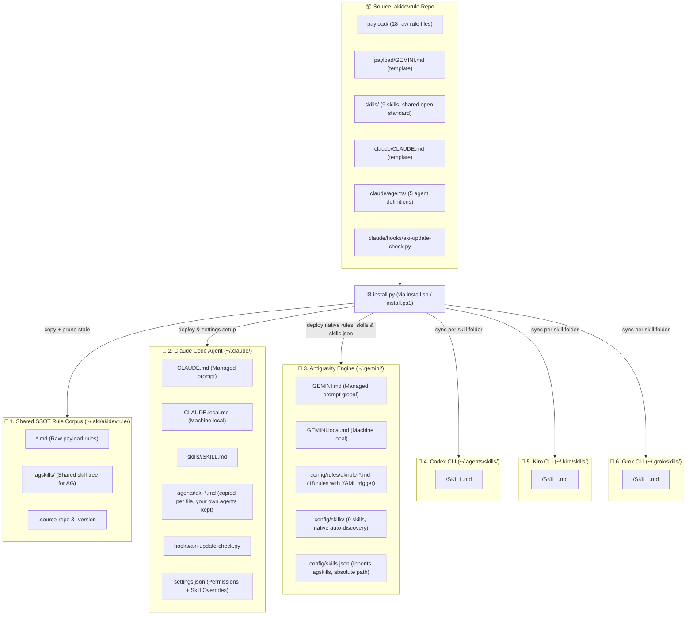

# akidevrule

One install command turns a fresh environment into Aki's full working baseline — for **Claude Code, Antigravity/Gemini, Codex CLI, Kiro CLI, and Grok CLI**, generated from one agent-neutral source: a shared rule corpus that loads itself at the right moment (Claude Code + Antigravity), plus a small set of sharp, single-purpose skills synced to every CLI that natively consumes the shared `SKILL.md` open standard.

```bash
curl -fsSL https://raw.githubusercontent.com/lacvietanh/akidevrule/master/install.sh | bash
```

Also available: `bash install.sh` from a local checkout, or the docs-site wrapper `curl -fsSL https://dev.akitao.com/claudedoc/install.sh | bash`. The launcher is intentionally simple — inspect it before running.

On **Windows**, clone the repo and run the Python installer directly (inspectable, matching this repo's philosophy):

```powershell
git clone https://github.com/lacvietanh/akidevrule.git; cd akidevrule; .\install.ps1
# or: py -3 install.py
```

This Git repository is the source of truth; `dev.akitao.com` is the presentation layer. Edit here, run the installer, done. It is **not** an auto-updater, daemon, package manager, or control plane.

## Contents

- [Requirements](#requirements)
- [What you get](#what-you-get)
- [Repository layout](#repository-layout)
- [What the installer does](#what-the-installer-does)
- [Gemini / Antigravity model](#gemini--antigravity-model)
- [What is excluded](#what-is-excluded)
- [Why `~/.aki/akidevrule`](#why-akiakidevrule)
- [Uninstall](#uninstall)

## Requirements

The installer is `install.py` — one cross-platform Python program (`pathlib` / `shutil` / `json`, no `rsync` / `find` / `awk`). `install.sh` and `install.ps1` are thin launchers that locate a Python interpreter and hand off to it. The skill helper scripts under `skills/akiflow/scripts/` are Python too (`*.py` is the source of truth; the matching `*.sh` files are transitional Unix wrappers).

| Platform | Status | Notes |
|---|---|---|
| macOS | ✅ Supported | Primary target. Run `./install.sh` or `python3 install.py`. |
| Linux | ✅ Supported | Any distribution with Python 3. Run `./install.sh` or `python3 install.py`. |
| Windows | ✅ Supported | Run `install.ps1` in PowerShell, or `py -3 install.py`. No WSL, Git Bash, or POSIX shell required — installer, hooks, and every skill helper are Python. Verified on `windows-latest` in CI. |

Tooling — have these installed first:

- **Python 3.7+** — the one hard requirement (installer, hooks, and all skill helper scripts are Python). `install.sh` picks the newest interpreter on PATH that meets this floor, so a host whose `python3` points at an older build still installs cleanly as long as any ≥3.7 Python is present; below the floor it stops with one clear message instead of a cryptic error.
- `git` — for the `git clone` remote install.

Interpreter convention (documented once): **Unix** uses `python3` (via `./install.sh`); **Windows** uses `py -3` / `python` (via `install.ps1`). The bundled skill scripts follow the same rule.

## What you get

### Nine skills

| Skill | Invoke | Purpose |
|---|---|---|
| `akirule` | automatic, every conversation | Smart rule router — contextual rules on signal match, everything on `nạp full` / `load all rules`. Core rules do not pass through it: the harness `@`-imports them, so they hold even when this skill never runs. Also owns the **`[RULES]` receipt** — one mandatory line reporting the whole rule context (`core` + `router` + a `missing:` field), so that "the rule never arrived" stops sharing a signature with "the rule arrived and was ignored". Hidden from the `/` menu by design. |
| `akiflow` | `/akiflow` | Lead-coordinated **agent council** for work needing more than one kind of judgment. The lead's job is two laws: **ANCHOR** — the owner's verbatim message is pinned as the run's immutable first block (`council_open.py` refuses to open a room without it) and every numbered requirement must quote a fragment of it; and **JUSTIFICATION** — every seat, check and script is OFF by default and turns on only when this run produces a reason, so there are no standing seats and no roster derived from a tier. It decomposes the request into owned work items, checks a three-condition activation gate, and convenes seats from the five definitions in `~/.claude/agents/` — one batch, each seat traced to a requirement, never picked from a menu. Three modes discriminated by one question, *what changes outside the room*: `discuss`, `audit` (read-only by construction), `execute` (only `aki-maker` may write). The lead does no menial work and settles what doctrine answers, escalating only a one-way door, a contradiction with documented design, or scope expansion — then writes the owner's answer back into doctrine the same turn, so a question never escalates twice. `council_verify.py` refuses closure on a missing anchor, a requirement quoting nothing the owner wrote, a declared seat that never posted, a posting agent with no `[RULES]` receipt, or an unanswered reminder — and deliberately requires no named seat, since an earlier version that did forced a seat to exist in a run with nothing to enforce and was gamed rather than questioned. Close-out reconciles declared model tiers against actual spend, cross-CLI calls added by hand since they never appear in the transcript. Design record: [`docs/arch/akiflow.md`](docs/arch/akiflow.md). |
| `akithink` | `/akithink` | Structured deep-thinking session for big, hard-to-reverse, or goal-ambiguous decisions: restate → goal excavation → first principles → mandatory critique → convergence into a `docs/` decision record. Recommends a top-tier model (Opus/Fable). |
| `akihtmlreport` | `/akihtmlreport` | Distills a dense analysis already in the conversation into one self-contained, ultra-wide `REPORT.html` at the project root — no new analysis, no dropped detail — then opens it locally. Exactly one per project; asks before overwriting. |
| `akihelp` | `/akihelp` | Live introduction to the whole installed Aki system, rendered by reading `index.md` and skill frontmatters at runtime — it can never go stale. Includes a **painpoint → what to say** table (sprawling CSS, docs that no longer match code, a half-finished tree, a pre-ship check, a hard-to-reverse decision, padded or hard-wrapped output, over-guarded flows, UX friction, pricing calls) built from that live state, with any row whose target is not installed dropped rather than shown. Closes on the caveat that governs everything else: `akirule` is a skill and therefore best-effort, so name the rule file in the prompt whenever the load must be deterministic. |
| `akigitcommit` | `/akigitcommit` | Turns a messy working tree into a few clean, logically grouped Conventional Commits. Triages a half-finished tree first — finished vs mid-edit vs abandoned vs accidental, asking rather than guessing — then stages by explicit path, never `git add -A`, never pushes unasked. |
| `aki-article-writer` | `/aki-article-writer` or natural language | Per-project article writing pipeline: research & fact-verification, SEO metadata, JSON-LD schema, UX-psychology-aware content, and a dedicated Image Scout subagent (Gemini Flash / Haiku) for search → download → visual inspection → ffmpeg processing → slug-named WebP output. One subagent per article; image work is always isolated to a separate lightweight subagent. |
| `akidevsync-notes` | natural language | Reads/edits a project's `.akidevsync/notes.json` — the per-project task list the Aki-Dev-Sync app itself writes (list/add/pin/mark-done/edit/delete tasks) via a bundled script that preserves the app's own JSON formatting, plus a workflow for cross-checking pinned notes against a shipped release (CHANGELOG + code) before marking them done. |
| `akilint` | `/akilint` or a penalty card | Mechanical format lint for the penalty-card classes of `RULE-agent-behavior.md` §0: hard-wrapped code comments and markdown prose (`[WRAP]`) and oversize comments (`[YAP]`, always labeled *review* — a flag for judgment against `coding.B4`, never an auto-delete verdict). Thin wrapper over the shared `scythe.py` detector (deterministic line matching, exit-code aware, cannot fabricate evidence) — the same script akiflow's `akirule-enforcer` uses, so a card name means the same thing everywhere. `[FLUFF]` (density) is content judgment and explicitly out of a script's reach. |

### Five agent definitions

A seat used to be convened by job title and then handed rules. The order is inverted here: an agent **is** a system prompt plus a rule set, and a name with no distinct filter behind it is a rule demanding a salary. Writing them in Claude Code's own `~/.claude/agents/` format makes three properties mechanical that had only ever been prose — read-only enforcement (`tools:` simply omits Edit/Write), the model tier (`model:`, so it is never improvised mid-run), and the fact that an undefined seat cannot be convened at all.

| Agent | Tools | Standard of "correct" |
|---|---|---|
| `aki-hands` | Read, Grep, Glob | none — **judgment forbidden**; facts with `file:line` only. Carries the cross-CLI substrate table (Claude subagent · agy flash · kiro-cli · `cl-9rt` proxy lane), with flags and failure modes read from recorded harness facts rather than re-probed |
| `aki-judge` | Read, Grep, Glob | **exactly one** standard, named at spawn (`pattern`, `proportion`, `ux`, `db`, …). Several standards in one head average into one mild opinion and the disagreement — the useful part — disappears |
| `aki-conduct` | + Bash | the corpus itself. Its unique job is separating **LOAD-fail** (the rule never arrived) from **COMPLY-fail** (it arrived and was violated); `scythe.py` is one of its tools, never a seat and never a gate |
| `aki-challenger` | Read, Grep, Glob | attacks the result from a clean context — defined by what it is *not* given (the reasoning). Always closes with *"what can be cut?"* and *"does this answer the anchored words?"* |
| `aki-maker` | Read, Edit, Write, Bash | `coding` + `pattern` + the domain rules in its brief. The only agent permitted to write, and therefore the most narrowly scoped: it implements a decision, it does not make one |

A catalog is not a roster. Five files on disk make it easy to pick seats from a menu, which is the failure they were built to end — a seat is convened only when it traces to a requirement in the owner's own words.

**Claude Code only, deliberately.** `SKILL.md` is an open standard with five implementations; an agent-definition format currently has one, so building a vendor-neutral layer over a single consumer would be exactly the speculative generality `pattern.A2` forbids. Reopen trigger: a second CLI publishing an agent format promotes `claude/agents/` to a top-level `agents/` rendered per vendor, the way `AG_RULE_MAP` already renders rules for Antigravity.

### A rule corpus that routes itself

`payload/` files follow a strict naming convention:

- `RULE-*.md` — constraints: what the agent must or must not do (behavior, coding, design/patterns, docs, content, stacks — Nuxt/Cloudflare + Tauri, UI, SEO, release, DB design, business/market).
- `METHOD-*.md` — analytical frameworks: how to reason through a specific class of problem. Heavy, loaded only when the task is genuinely analytical.
- `index.md` — file manifest, precedence order, project-binding policy.

Loading happens on two different mechanisms, and the difference matters more than the tier numbering does.

**Core — harness-embedded, not routed.** `index.md`, `RULE-agent-behavior.md`, `RULE-coding.md` and `RULE-pattern-core.md` are `@`-imported by `~/.claude/CLAUDE.md`, which Claude Code reads mechanically at session start. No model decision is involved, so they are the only rules that genuinely apply to every task. The two rule files were promoted out of Tier 1 after "default ON" proved to be a statement of intent rather than a mechanism: routing them through a skill meant they loaded only when the model first chose to invoke that skill, and the rules needing the most owner correction were absent from the context rather than present and disobeyed. They cost context in every session, including sessions with no code in them — that is the price of the guarantee. `@` imports have this effect **only** inside `CLAUDE.md` — the same syntax written into a skill body looks like an import but loads nothing, because a skill body is read only after the model has already chosen to invoke the skill.

**Everything else — routed by the `akirule` skill**, and therefore best-effort: it applies when the model invokes the skill and a signal matches. Sensitivity is deliberately high (err toward loading — a false positive costs a few tokens, a false negative causes wrong behavior).

- **Tier 1 — Contextual, read on signal match:** `RULE-docs.md` (structure and lifecycle, plus the docs-vs-code drift audit), `RULE-content-write.md` (UI copy and writing style, plus the content audit — canonical-term drift, density deletion test, i18n coverage), `RULE-stack-akiNuxtCf.md`, `RULE-stack-tauri.md` (Tauri v2 + Rust: never-block-the-UI, version SSOT, target context), `RULE-ui-pattern.md` (design-system layer: the subtraction pass that runs before the tier ladder, class taxonomy, tokens, variant API, and the audit playbook), `RULE-seo.md`, `RULE-release.md`, `RULE-db-design.md`, `RULE-biz.md` (market-facing decisions: positioning, pricing, audience) — plus the analytical methods (tagged `Analytical` in `index.md`, but mechanically signal-loaded like the rest of Tier 1): `METHOD-flow-audit.md` (refactors, multi-file bugs, fragile flows), `METHOD-zero-trust-audit.md` (strict mechanical-first audit: detectors before opinion, exact matches separated from pattern-level candidates), `METHOD-deep-think.md` (scope/architecture/value decisions, first-principles and critique-style thinking), `METHOD-ux-psych.md` (UX/user-behavior evaluation, onboarding and conversion flows), `METHOD-proportionality.md` (sizing a guard, limit or accepted risk against reach, capability, motive and blast radius — the lens that stops both over-engineering and client-side-limits-as-enforcement), and `METHOD-subtraction-audit.md` (repo-wide "does this need to exist" sweep, terminating on two dry rounds).
- **Tier 2 — Full load on explicit command:** `nạp full` / `load all rules` reads every `RULE-*`/`METHOD-*` file at once.

No harness magic beyond the `CLAUDE.md` import: Tier 1 is trigger instructions telling Claude to Read the file from `~/.aki/akidevrule/` when signals match; Tier 2 is the explicit-command escape hatch.

### Addressing — `topic.A1`, and the `⟨Aki⟩` flag

Every rule/method file is internally organized into groups `A`/`B`/`C` and numbered items `1`/`2`/`3…`, so any single rule can be named precisely — `coding.B2` (changing existing code), `stack.C1` (canonical component names) — without touching routing or renaming any file (`topic` is the filename minus its `RULE-`/`METHOD-` prefix). The full group map lives in `payload/index.md`.

Three files (`RULE-seo.md`, `RULE-release.md`, `RULE-stack-akiNuxtCf.md`) mix universal rules with content specific to Aki's own AkiNuxtCf ecosystem (usePageSeo API, releases.json schema, canonical component names, …). That ecosystem-specific content is isolated into each file's **last group**, logically flagged `⟨Aki⟩`. It stays in this public repo and auto-loads like everything else — Aki is this repo's heaviest user, so auto-load stays more valuable than a clean public/private split — but the flag marks exactly what a stripped public export would drop. Every other file, and every group outside `⟨Aki⟩`, is 100% universal.

### One brain, two modes

`METHOD-deep-think.md` is a single analytical brain — goal excavation, first principles, mandatory critique, conditional techbiz lens — consumed two ways:

- **Passive:** `akirule` auto-loads it inline when a normal task hits a signal ("should we…", "is it worth…", tradeoff talk). Applied briefly inside the current answer, at most one clarifying question. Carries a radar rule: if the decision turns out to be one-way-door, large-scope, or goal-ambiguous, it must say "this deserves a `/akithink` session" instead of settling for a shallow pass.
- **Active:** the user runs `/akithink`, which drives the same METHOD through a full 5-phase interactive protocol at maximum depth and ends with a proposed decision record under `docs/` (plus `/akihtmlreport` when the material is complex).

Content-wise, active is a superset of passive; mechanically, only `/akithink` runs the interactive protocol.

### Update notifications — notify-only

A `SessionStart` hook compares the installed `CHANGELOG.md` against the public repo copy (at most once per 24h, fail-silent, never blocking). When the remote is newer it prints what's new and the update command (`git pull && ./install.sh` on Unix, `git pull; py -3 install.py` on Windows). It never downloads or installs anything on its own.

## Repository layout

```text
payload/                          → installed to ~/.aki/akidevrule/
  index.md
  RULE-agent-behavior.md
  RULE-coding.md
  RULE-pattern-core.md
  RULE-docs.md
  RULE-content-write.md
  RULE-stack-akiNuxtCf.md
  RULE-stack-tauri.md
  RULE-ui-pattern.md
  RULE-seo.md
  RULE-release.md
  RULE-db-design.md
  RULE-biz.md
  METHOD-flow-audit.md
  METHOD-zero-trust-audit.md
  METHOD-deep-think.md
  METHOD-ux-psych.md
  METHOD-proportionality.md
  METHOD-subtraction-audit.md
  GEMINI.md                       → installed to ~/.gemini/GEMINI.md (NOT a rule file)

skills/                            → shared Agent Skills corpus (SKILL.md open standard), deployed
                                     unmodified to BOTH ~/.claude/skills/ and ~/.gemini/config/skills/
  akirule/SKILL.md
  akiflow/SKILL.md
  akiflow/scripts/council_open.py      (opens + prunes the session workspace)
  akiflow/scripts/council_read.py      (slices chat.md without loading it whole)
  akiflow/scripts/council_cost.py      (tallies per-agent token usage from the transcript at close-out)
  akiflow/scripts/council_verify.py    (mechanical closure gate: ghost seats, missing evidence tags, unanswered REMINDs)
  akiflow/scripts/scythe.py            (penalty-card lint [WRAP]/[YAP] — shared engine of /akilint and the enforcer's evidence sweeps)
  akiflow/scripts/*.sh                 (transitional Unix wrappers, one per script above — each execs its .py sibling)
  akiflow/references/harness-facts.md  (subagent/cost/model facts, with sources)
  akithink/SKILL.md
  akihtmlreport/SKILL.md
  akihelp/SKILL.md
  akigitcommit/SKILL.md
  akilint/SKILL.md
  aki-article-writer/SKILL.md
  aki-article-writer/references/article-workflow.md

claude/                           → Claude Code-only runtime assets, installed to ~/.claude/
  CLAUDE.md
  agents/aki-hands.md             → ~/.claude/agents/, copied per file (your own agents there survive)
  agents/aki-judge.md
  agents/aki-conduct.md
  agents/aki-challenger.md
  agents/aki-maker.md
  hooks/aki-update-check.py
  fragments/settings.akidoc.fragment.json   (illustrative reference only — never apply manually)

install.py                                  (cross-platform SSOT installer)
install.sh                                  (thin Unix launcher → python3 install.py)
install.ps1                                 (thin Windows launcher → py -3 install.py)
```

## What the installer does



Targets 4-6 only get the shared skill corpus (no rule corpus / no `CLAUDE.md`/`GEMINI.md`-style overrides — those CLIs have no equivalent hard-load hook this baseline plugs into yet). Each sync is scoped per skill folder name via a Python `shutil` copy plus a managed-names-only prune, same never-touch-the-rest guarantee as targets 2 and 3, and runs unconditionally — harmless if that CLI isn't installed on the machine, picked up the moment it is.

1. Syncs `payload/*` into `~/.aki/akidevrule/` (Python `shutil` copy, excludes `ref-ECC/`), removing stale files left by renames, and syncs `agskills/` for Antigravity skill inheritance.
2. Syncs every skill folder under `skills/*/` (whole directory, including any `references/` or `scripts/`) into `~/.claude/skills/`, one named folder at a time (copy + managed-names-only prune), removing only Aki's own old/renamed skill directories (`akidoc-*`, `akiadvise`) — any other skill you already have is never touched. `skills/` is a top-level, agent-neutral folder (siblings with `payload/`, not nested under `claude/`) because SKILL.md is a shared open standard both Claude Code and Antigravity/AGY consume identically — see [docs/ref/agent-skills-standard.md](docs/ref/agent-skills-standard.md).
3. Copies `claude/agents/*.md` into `~/.claude/agents/` **file by file, never a directory mirror with `--delete`** — that folder is a shared namespace where your own agent definitions sit beside Aki's, exactly like `~/.claude/skills/`, so nothing you did not install is ever removed.
4. Replaces `~/.claude/CLAUDE.md` with the packaged guidance (timestamped backup first), appending this machine's source-repo path and an `@~/.claude/CLAUDE.local.md` import.
5. Creates `~/.claude/CLAUDE.local.md` **only if missing** — never overwritten afterward. Put per-machine rules there (build constraints, IDE paths, remote flags); they survive every reinstall.
6. Updates `~/.claude/settings.json` (timestamped backup first): read permission for `~/.aki/akidevrule/**`, `skillOverrides.akirule = "on"`, idempotent registration of the `SessionStart` update-check hook.
7. Installs `~/.claude/hooks/aki-update-check.py` and records the source-repo path in `~/.aki/akidevrule/.source-repo`.
8. Installs `payload/GEMINI.md` to `~/.gemini/GEMINI.md` — Antigravity global behavior overrides, stamped with a version marker (`[AKIRULE-AG-OVERRIDES-…]`) on line 1. Generates 18 native rule files under `~/.gemini/config/rules/` with YAML `trigger` frontmatter. Deploys 9 skills directly to `~/.gemini/config/skills/` for native auto-discovery (synced per skill folder, same never-touch-the-rest guarantee as step 2), and configures `~/.gemini/config/skills.json` with absolute paths as secondary.
9. Syncs the same skill folders to `~/.agents/skills/` (Codex CLI), `~/.kiro/skills/` (Kiro CLI), and `~/.grok/skills/` (Grok CLI) — each a plain global skills root these CLIs read natively, synced per skill folder name exactly like step 2. Skills-only: no rule corpus is generated for these targets.

Re-running the installer updates the same managed files cleanly.

## Gemini / Antigravity model

Claude Code loads the rule corpus automatically (harness-guaranteed `@`-imports via the `akirule` skill). Antigravity/Gemini has no such loader, so the split is: `~/.gemini/GEMINI.md` carries **hard-loaded behavior overrides** that patch Antigravity's weak spots (unrequested artifacts, over-engineering, verbosity), and a tiny per-project `GEMINI.md` bootstrap points the agent at that project's `CLAUDE.md` as its single source of truth. The per-project bootstrap is copied into a project by hand (it is not distributed by the installer).

## What is excluded

- `ref-ECC/` — a large reference corpus, not needed for standard operation.
- API keys, model-router tokens, localhost project permissions, unrelated personal Claude settings.
- Automatic download/install logic — the update hook is strictly notify-only.
- Any skill, rule, or file you already have that isn't part of this repo's managed set — every sync (Claude Code, Antigravity, Codex CLI, Kiro CLI, and Grok CLI skill directories included) touches only the paths/names akidevrule itself owns, never a blanket directory wipe. Verified in practice: `~/.grok/skills/` on this machine already held unrelated pre-existing skills (`best-of-n`, `docx`, `pptx`, …) and they were untouched by the sync.

## Why `~/.aki/akidevrule`

No sudo, user-local, easy to inspect and delete, consistent with the Aki ecosystem namespace.

## Uninstall

```bash
rm -rf ~/.aki/akidevrule
rm -rf ~/.aki/agent-council     # /akiflow session workspaces (self-prunes at 30 days anyway)
rm -rf ~/.claude/skills/{akirule,akiflow,akithink,akihtmlreport,akihelp,akigitcommit,akilint,aki-article-writer,akidevsync-notes}
rm -rf ~/.agents/skills/{akirule,akiflow,akithink,akihtmlreport,akihelp,akigitcommit,akilint,aki-article-writer,akidevsync-notes}   # Codex CLI
rm -rf ~/.kiro/skills/{akirule,akiflow,akithink,akihtmlreport,akihelp,akigitcommit,akilint,aki-article-writer,akidevsync-notes}     # Kiro CLI
rm -rf ~/.grok/skills/{akirule,akiflow,akithink,akihtmlreport,akihelp,akigitcommit,akilint,aki-article-writer,akidevsync-notes}     # Grok CLI (other, non-Aki skills already in this folder are untouched)
rm -f  ~/.claude/agents/aki-{hands,judge,conduct,challenger,maker}.md   # your own agents in that folder are untouched
rm -f  ~/.claude/hooks/aki-update-check.py
rm -f  ~/.gemini/GEMINI.md          # restore from a *.akidevrule-backup-* if needed; GEMINI.local.md is left untouched
```

On **Windows** the same targets live under `%USERPROFILE%` (e.g. `%USERPROFILE%\.aki\akidevrule`, `%USERPROFILE%\.claude\skills\...`); remove them with `Remove-Item -Recurse -Force`.

Then remove the akidevrule block from `~/.claude/CLAUDE.md` and its entries (permission, skillOverrides, SessionStart hook) from `~/.claude/settings.json` if desired.

## Content for dev.akitao.com

This README is the source material for the public docs page. The page should cover: why shared Claude Code rules matter; the `RULE-*`/`METHOD-*` convention; the split between harness-embedded core rules and the signal-triggered `akirule` router; the passive/active thinking split; what gets installed where; and why Git is the source of truth.
