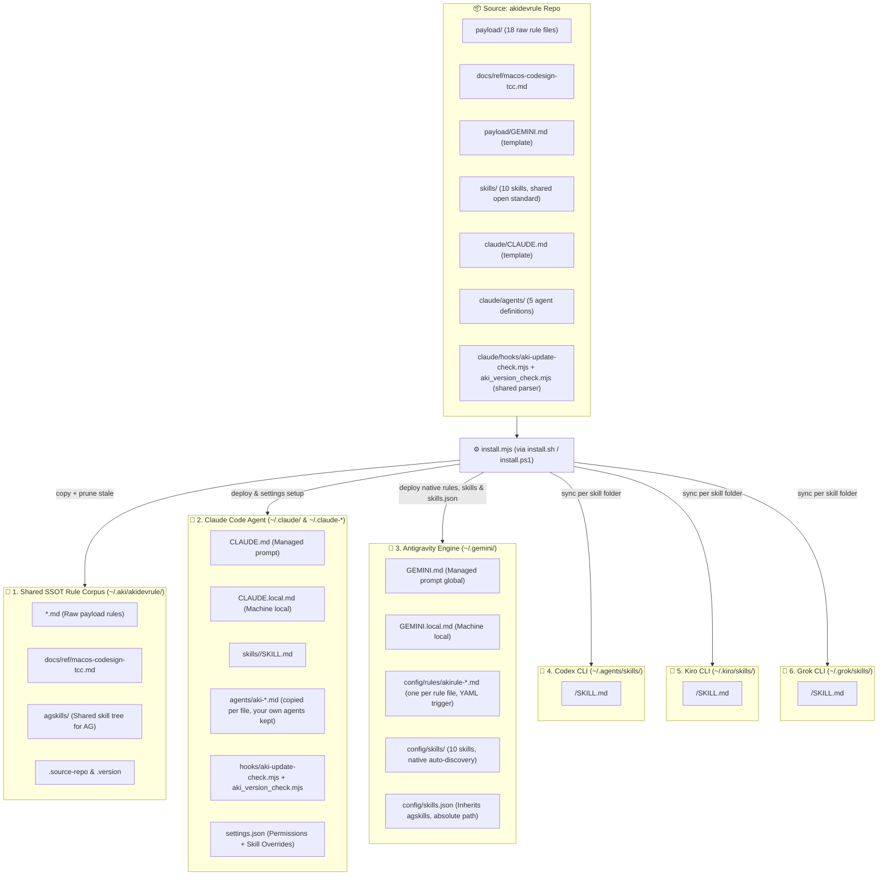

# akidevrule

One install command turns a fresh environment into Aki's full working baseline — for **Claude Code, Antigravity/Gemini, Codex CLI, Kiro CLI, Grok CLI, Cursor and OpenCode**, generated from one agent-neutral source: a shared rule corpus that loads itself at the right moment (Claude Code + Antigravity), plus a small set of sharp, single-purpose skills synced to every CLI that natively consumes the shared `SKILL.md` open standard.

**Quick install (npm):**

```bash
npx @akinet/akidevrule@latest
```

`npx` always fetches the latest published version — re-running the command is how you update. Requires **Node.js 18+** and nothing else. Add `--check` to print installed-vs-latest without changing anything: `npx @akinet/akidevrule@latest --check`.

**Or install with the shell one-liner:**

```bash
curl -fsSL https://raw.githubusercontent.com/lacvietanh/akidevrule/master/install.sh | bash
```

Also available: `bash install.sh` from a local checkout. The launcher is intentionally simple — inspect it before running.

On **Windows** (without npm), clone the repo and run the installer directly (inspectable, matching this repo's philosophy):

```powershell
git clone https://github.com/lacvietanh/akidevrule.git; cd akidevrule; .\install.ps1
# or: node install.mjs
```

This Git repository is the source of truth; `dev.akitao.com` is the presentation layer. Edit here, run the installer, done. It is **not** an auto-updater, daemon, package manager, or control plane.

## Contents

- [Requirements](#requirements)
- [What you get](#what-you-get)
- [Usage model](#usage-model)
- [Repository layout](#repository-layout)
- [What the installer does](#what-the-installer-does)
- [Gemini / Antigravity model](#gemini--antigravity-model)
- [What is excluded](#what-is-excluded)
- [Why `~/.aki/akidevrule`](#why-akiakidevrule)
- [Uninstall](#uninstall)

## Requirements

The installer is `install.mjs` — one cross-platform Node.js program (Node stdlib + global `fetch` only, no `rsync` / `find` / `awk`). `install.sh` and `install.ps1` are thin launchers that locate `node` and hand off to it. The skill helper scripts under `skills/akiflow/scripts/` are Python (`*.py` is the source of truth; the matching `*.sh` files are transitional Unix wrappers) — they run only when you invoke that skill, not to install or update.

| Platform | Status | Notes |
|---|---|---|
| macOS | ✅ Supported | Primary target. `npx @akinet/akidevrule@latest`, or `./install.sh` / `node install.mjs`. |
| Linux | ✅ Supported | Any distribution with Node 18+. `npx @akinet/akidevrule@latest`, or `./install.sh` / `node install.mjs`. |
| Windows | ✅ Supported | `npx @akinet/akidevrule@latest`, or `install.ps1` in PowerShell, or `node install.mjs`. No WSL, Git Bash, or POSIX shell required — the installer and hooks are pure Node. Verified on `windows-latest` in CI. |

Tooling — have these installed first:

- **Node.js 18+** — the one hard requirement to install or update. The installer and the SessionStart update-check hook are Node; the 18 floor is the built-in `fetch` the update check uses. `install.sh` / `install.ps1` locate `node` and stop with one clear message if it is missing.
- **Python 3.7+** — only to *run* the akiflow skill helper scripts (`skills/akiflow/scripts/*.py`); never needed for install or update.
- `git` — for the `git clone` remote install.

Interpreter convention (documented once): the installer and hooks run on `node` — the same command on every platform. The bundled skill helper scripts still use `python3` on Unix and `py -3` / `python` on Windows.

## What you get

### Ten skills

| Skill | Invoke | Purpose |
|---|---|---|
| `akirule` | automatic, every conversation | Rule router — `@`-imported by `~/.claude/CLAUDE.md` in Claude Code, a skill elsewhere. Routes each task turn by meaning (the domain touched and the act), anchored by bilingual concept signals that never gate; full corpus on an explicit load-everything request. Core rules do not pass through it. Also owns the **`[RULES]` receipt** — one mandatory line reporting the whole rule context (`core` + `router` — what is loaded, nothing else), so that "the rule never arrived" stops sharing a signature with "the rule arrived and was ignored". Hidden from the `/` menu by design. |
| `akiflow` | `/akiflow` | Lead-coordinated **agent council** for work needing more than one kind of judgment. The lead's job is two laws: **ANCHOR** — the owner's verbatim message is pinned as the run's immutable first block (`council_open.py` refuses to open a room without it) and every numbered requirement must quote a fragment of it; and **JUSTIFICATION** — every seat, check and script is OFF by default and turns on only when this run produces a reason, so there are no standing seats and no roster derived from a tier. It decomposes the request into owned work items, checks a three-condition activation gate, and convenes seats from the five definitions in `~/.claude/agents/` — one batch, each seat traced to a requirement, never picked from a menu. **Two shapes, discriminated by whether anything is actually being arbitrated.** A *council* is items with adversaries, for work where two competent seats could reach different defensible answers. A *dispatch* is lanes with exclusive file ownership, for a fan-out whose answer is already knowable and whose only real hazard is two workers writing the same file — `--convene` refuses an overlapping `writes:` before a token is spent. Dispatch drops the challenger, the debate and the three-condition gate; it keeps the anchor, the quoted requirements, the `[RULES]` receipts, the durable record and the whole closure gate. It exists because 19 of 70 live rooms posted no debate turn at all and 11 of those still did substantive fan-out work, paying council overhead for machinery they never used. Orthogonally, three modes discriminated by one question, *what changes outside the room*: `discuss`, `audit` (read-only by construction), `execute` (only `aki-maker` may write). The lead does no menial work and settles what doctrine answers, escalating only a one-way door, a contradiction with documented design, or scope expansion — then writes the owner's answer back into doctrine the same turn, so a question never escalates twice. `council_verify.py` refuses closure on a missing anchor, a requirement quoting nothing the owner wrote, a declared seat that left no trace anywhere in the session, a seat with no `[RULES]` receipt, or an unanswered reminder — reading each seat's own `<seat>.md` as well as its turns, and printing `SKIP` rather than `PASS` where there was nothing to check — and deliberately requires no named seat, since an earlier version that did forced a seat to exist in a run with nothing to enforce and was gamed rather than questioned. **A read is a subscription, not a purchase** — the cost model that shapes how the room is used: every turn re-sends the whole history, so a read of size `S` at turn `t` of a `T`-turn run is charged about `S × (T − t)`, and pulling a 50k-token room at turn 50 of 200 costs ~7.5M cache-read tokens from one call. Measured on a real run with three `aki-maker` seats doing every file edit, the lead still held 70% of cache-read and 66% of output: delegation moves the work but not the money, because what a run pays for is the lead's own accumulated context. Hence `council_read.py --grep` to locate for a few hundred bytes and `--turn` to pull only what the grep pointed at. Close-out reconciles declared model tiers against actual spend, cross-CLI calls added by hand since they never appear in the transcript. Design record: [`docs/arch/akiflow.md`](docs/arch/akiflow.md). |
| `akithink` | `/akithink`, or self-run | Structured deep thinking: restate → goal excavation → first principles → mandatory critique → convergence into a `docs/` decision record. Self-run (model-invoked, non-interactive, decide-and-report) whenever the task is a decision rather than execution; interactive only when the owner asks. Recommends a top-tier model (Opus/Fable). |
| `akihtmlreport` | `/akihtmlreport` | Distills a dense analysis already in the conversation into one self-contained, ultra-wide `REPORT.html` at the project root — no new analysis, no dropped detail — then opens it locally. Exactly one per project; asks before overwriting. |
| `akihelp` | `/akihelp` | Live introduction to the whole installed Aki system, rendered by reading `index.md` and skill frontmatters at runtime — it can never go stale. Includes a **painpoint → what to say** table (sprawling CSS, docs that no longer match code, a half-finished tree, a pre-ship check, a hard-to-reverse decision, padded or hard-wrapped output, over-guarded flows, UX friction, pricing calls) built from that live state, with any row whose target is not installed dropped rather than shown. Closes on the caveat that governs everything else: the router is always present but the `Read` of a routed file is still model-dependent, so name the rule file in the prompt whenever the load must be deterministic. |
| `akigitcommit` | `/akigitcommit` | Turns a messy working tree into a few clean, logically grouped Conventional Commits. Triages a half-finished tree first — finished vs mid-edit vs abandoned vs accidental, asking rather than guessing — then stages by explicit path, never `git add -A`, never pushes unasked. |
| `aki-article-writer` | `/aki-article-writer` or natural language | Per-project article writing pipeline: research & fact-verification, SEO metadata, JSON-LD schema, UX-psychology-aware content, and a dedicated Image Scout subagent (Gemini Flash / Haiku) for search → download → visual inspection → ffmpeg processing → slug-named WebP output. One subagent per article; image work is always isolated to a separate lightweight subagent. |
| `akidevsync-notes` | natural language | Reads/edits a project's `.akidevsync/notes.json` — the per-project task list the Aki-Dev-Sync app itself writes (list/add/pin/mark-done/edit/delete tasks) via a bundled script that preserves the app's own JSON formatting, plus a workflow for cross-checking pinned notes against a shipped release (CHANGELOG + code) before marking them done. |
| `akilint` | `/akilint` or a penalty card | Mechanical format lint for the penalty-card classes of `RULE-agent-behavior.md` §0: hard-wrapped code comments and markdown prose (`[WRAP]`) and oversize comments (`[YAP]`, always labeled *review* — a flag for judgment against `coding.B4`, never an auto-delete verdict). Thin wrapper over the shared `scythe.py` detector (deterministic line matching, exit-code aware, cannot fabricate evidence) — the same script akiflow's `aki-conduct` seat uses, so a card name means the same thing everywhere. `[FLUFF]` (density) is content judgment and explicitly out of a script's reach. |
| `akiship` | `/akiship` | One-command full release: front-loads every check (release state, tree triage), then runs `RULE-release.md` B7's fail-closed checklist unattended (CRITICAL mandatory `Read` of `RULE-release.md` and `RULE-docs.md` first; a `S0`–`S8` receipt line with quoted evidence per step or the step counts as NOT RUN; written self-interrogation) — diff-scoped hygiene (scythe, dead code, comment doc-refs on the accumulation only), migration doctrine (`RULE-release.md` B5: detector over the diff on every release, startup-embedded migration counts, rehearsal from the PREVIOUS state) and external-action completeness, record truthfulness, build & test mirroring CI (B7 step 6), doc sync across every record surface (plans, `arch`/`feat`, README, task notes, bound standards docs), version mint or defer, registry publish for npm/crates/PyPI packages (`RULE-release.md` B9 — an OTP-gated publish is the single hand-off) — committing via `akigitcommit` with confirmation pre-answered. **Activation is an explicit release order**: the literal token `/akiship`, or an equally explicit imperative naming the ritual for this repo ("release trọn vẹn đi") — a completion word with no release object ("làm cho trọn vẹn"), or `/akiship` inside a question, activates nothing and gets a consult (answer in chat, change nothing). Governed by the B8 contract: that order is the authorization, blockers are reported once as a batch or the run completes with zero mid-run questions, and it stops only for public-history ambiguity, unclassifiable work, or a design contradiction — an owner-worded completion criterion is derived from the anchor plus the repo's own records and decided/reported (`Decided: X · because Y · rejected Z (why) · reopen if W`), escalated only when competing readings would produce different irreversible artifacts. Push/deploy stay opt-in — named explicitly, or via completion-intensity phrasing (canonical list in `RULE-release.md` B8, e.g. "trọn vẹn") — and after any push, CI is watched to green (`RULE-release.md` B10) regardless of whether the stack deploys, and after any deploy a data path the release touched is exercised (`RULE-release.md` B11). |

### Five agent definitions

A seat used to be convened by job title and then handed rules. The order is inverted here: an agent **is** a system prompt plus a rule set, and a name with no distinct filter behind it is a rule demanding a salary. Writing them in Claude Code's own `~/.claude/agents/` format makes three properties mechanical that had only ever been prose — read-only enforcement (`tools:` simply omits Edit/Write), the model tier (`model:`, so it is never improvised mid-run), and the fact that an undefined seat cannot be convened at all.

| Agent | Tools | Standard of "correct" |
|---|---|---|
| `aki-hands` | Read, Grep, Glob | none — **judgment forbidden**; facts with `file:line` only. Carries the cross-CLI substrate table (Claude subagent · agy flash · kiro-cli · `cl-9rt` proxy lane), with flags and failure modes read from recorded harness facts rather than re-probed |
| `aki-judge` | Read, Grep, Glob | **exactly one** standard, named at spawn (`pattern`, `proportion`, `ux`, `db`, …). Several standards in one head average into one mild opinion and the disagreement — the useful part — disappears |
| `aki-conduct` | + Bash | the corpus itself. Its unique job is separating **LOAD-fail** (the rule never arrived) from **COMPLY-fail** (it arrived and was violated); `scythe.py` is one of its tools, never a seat and never a gate |
| `aki-challenger` | Read, Grep, Glob | attacks the result from a clean context — defined by what it is *not* given (the reasoning). Always closes with *"what can be cut?"* and *"does this answer the anchored words?"* |
| `aki-maker` | Read, Edit, Write, Bash | `coding` + `pattern` + the domain rules in its brief. The only agent permitted to write, and therefore the most narrowly scoped: it implements a decision, it does not make one |

A catalog is not a roster. Five files on disk make it easy to pick seats from a menu, which is the failure they were built to end — a seat is convened only when it traces to a requirement in the owner's own words.

**Claude Code only, deliberately.** `SKILL.md` is an open standard with five implementations; an agent-definition format currently has one, so building a vendor-neutral layer over a single consumer would be exactly the speculative generality `pattern.A2` forbids. Reopen trigger: a second CLI publishing an agent format promotes `claude/agents/` to a top-level `agents/` rendered per vendor, the way `AG_RULE_MAP` already renders rules for Antigravity.

### A rule corpus that routes itself

`payload/` files follow a strict naming convention:

- `RULE-*.md` — constraints: what the agent must or must not do (behavior, coding, design/patterns, docs, content, stacks — Nuxt/Cloudflare + Tauri, UI, SEO, release, DB design, business/market).
- `METHOD-*.md` — analytical frameworks: how to reason through a specific class of problem. Heavy, loaded only when the task is genuinely analytical.
- `index.md` — file manifest, precedence order, cross-cutting lens.

Loading happens on two different mechanisms.

**Core and router — harness-embedded.** `index.md`, `RULE-agent-behavior.md`, `RULE-coding.md`, `RULE-pattern-core.md` and the router `skills/akirule/SKILL.md` are `@`-imported by `~/.claude/CLAUDE.md`, which Claude Code reads mechanically at session start. No model decision is involved, so the four rule files genuinely apply to every task and the routing is always present. The router joined them for the same reason: as a skill it went uninvoked until the owner asked for it by name. The two rule files were promoted out of the router after "default ON" proved to be a statement of intent rather than a mechanism: routing them through a skill meant they loaded only when the model first chose to invoke that skill, and the rules needing the most owner correction were absent from the context rather than present and disobeyed. They cost context in every session, including sessions with no code in them — that is the price of the guarantee. `@` imports have this effect **only** inside `CLAUDE.md` — the same syntax written into a skill body looks like an import but loads nothing, because a skill body is read only after the model has already chosen to invoke the skill.

**Everything else — routed by meaning.** Each task turn is classified by the domains it touches and the act (create, decide, audit, ship), in any language; each route carries concept signals in English and Vietnamese as evidence, never as the test, so a paraphrase routes as well as the listed word. The one model-dependent hop left is the `Read` of a routed file. Sensitivity is deliberately high (err toward loading — a false positive costs a few tokens, a false negative causes wrong behavior).

- **Contextual and analytical — read on route match:** `RULE-docs.md` (structure and lifecycle, plus the docs-vs-code drift audit), `RULE-content-write.md` (UI copy and writing style, plus the content audit — canonical-term drift, density deletion test, i18n coverage), `RULE-stack-akiNuxtCf.md`, `RULE-stack-tauri.md` (Tauri v2 + Rust: never-block-the-UI, version SSOT, target context, the macOS TCC/Gatekeeper boundary for spawned sidecars), `RULE-ui-pattern.md` (design-system layer: the subtraction pass that runs before the tier ladder, class taxonomy, tokens, variant API, and the audit playbook), `RULE-seo.md`, `RULE-release.md`, `RULE-db-design.md`, `RULE-biz.md` (market-facing decisions: positioning, pricing, audience) — plus the analytical methods (tagged `Analytical` in `index.md`, loaded on route match like the rest): `METHOD-audit-flow.md` (refactors, multi-file bugs, fragile flows), `METHOD-audit-zero-trust.md` (strict mechanical-first audit: detectors before opinion, exact matches separated from pattern-level candidates), `METHOD-deep-think.md` (scope/architecture/value decisions, first-principles and critique-style thinking), `METHOD-ux-psych.md` (UX/user-behavior evaluation, onboarding and conversion flows), `METHOD-proportionality.md` (sizing a guard, limit or accepted risk against reach, capability, motive and blast radius — the lens that stops both over-engineering and client-side-limits-as-enforcement), `METHOD-audit-subtraction.md` (repo-wide "does this need to exist" sweep, terminating on two dry rounds), and `METHOD-audit-frozen-reference.md` (compliance audit for a clause naming a concrete external artifact as the canonical shape to match — resolve to an exact path, diff literally against it, never judge from memory of the rule's prose).
- **Full load on explicit request:** asking, in any wording, to load the whole corpus reads every `RULE-*`/`METHOD-*` file at once.

No harness magic beyond the `CLAUDE.md` import: routes are instructions telling Claude to Read the file from `~/.aki/akidevrule/` when the task's domain matches; the full-load request is the escape hatch.

### Addressing — `topic.A1`, and the `⟨Aki⟩` flag

Every rule/method file is internally organized into groups `A`/`B`/`C` and numbered items `1`/`2`/`3…`, so any single rule can be named precisely — `coding.B2` (changing existing code), `stack.C1` (canonical component names) — without touching routing or renaming any file (`topic` is the filename minus its `RULE-`/`METHOD-` prefix). The full group map lives in `payload/index.md`.

Three files (`RULE-seo.md`, `RULE-release.md`, `RULE-stack-akiNuxtCf.md`) mix universal rules with content specific to Aki's own AkiNuxtCf ecosystem (usePageSeo API, releases.json schema, canonical component names, …). That ecosystem-specific content is isolated into each file's **last group**, logically flagged `⟨Aki⟩`. It stays in this public repo and auto-loads like everything else — Aki is this repo's heaviest user, so auto-load stays more valuable than a clean public/private split — but the flag marks exactly what a stripped public export would drop. Every other file, and every group outside `⟨Aki⟩`, is 100% universal.

### Project binding & change policy

Each project keeps a root `CLAUDE.md` that binds its stack and any reference implementation (a standing route signal for the router), defines project-specific facts and overrides, stays short, and avoids duplicating shared rules. Every line in it is paid on every request, so it is admitted line by line through `docs.A5`.

Aki-RULE changes affect many projects. Before changing rule files, clarify the intended rule, scope, and tradeoff unless the user explicitly requests the exact change.

### One brain, three modes

`METHOD-deep-think.md` is a single analytical brain — goal excavation, first principles, mandatory critique, conditional techbiz lens — consumed three ways:

- **Passive:** the router loads it inline whenever a task evaluates, decides or critiques rather than only executes. Applied briefly inside the current answer, at most one clarifying question.
- **Triggered self-run:** fired by `agent.A3`'s mandatory deep-think triggers (about to ask/escalate, a one-way-door action, a repeated fix failure, conflicting rules, ambiguous owner wording, a documented-design touch) or by owner authorization. Non-interactive — depth scales to difficulty instead of a fixed round count, and it ends in decide-and-act (reported as `Decided: X · because Y · rejected Z (why) · reopen if W`) or escalates per `agent.A3`'s outcomes, never in a question left hanging or an offer to open `/akithink`.
- **Active:** `/akithink` drives the same METHOD at maximum depth. It self-runs, model-invoked and non-interactive, whenever the task is a genuine decision — approach choice, critique of a plan/idea/rule, scope tradeoff, a documented-design change — and runs its 5-phase interactive protocol only when the owner asks for a session; both end in a decision record under `docs/` when the decision is durable (plus `/akihtmlreport` when the material is complex).

Content-wise, the triggered and active modes are supersets of the passive one; mechanically, only `/akithink`'s default invocation runs the interactive protocol.

### Update notifications — notify-only

A `SessionStart` hook and the installer's `--check` flag both classify install status through one shared parser (`claude/hooks/aki_version_check.mjs`), which reads a keep-a-changelog file's *latest released* version — its first `## [x.y.z]` heading, skipping the `[Unreleased]` buffer at the top (a version comparison that matched `[Unreleased]` against `[Unreleased]` on both sides never detected an update at all — fixed by porting aki-mcp-sv's `parseChangelogVersion`/`cmpSemver` algorithm). Five states, one classifier, two consumers:

| State | Condition | Hook (SessionStart) | `install.mjs --check` |
|---|---|---|---|
| **missing** | no installed `CHANGELOG.md` (or `index.md`) | announces every session — no 24h throttle | prints "not installed" + the install command |
| **current** | installed released semver == remote | silent | prints "up to date" (`run_install()` skips its y/n overwrite prompt only when `.version`'s `commit=` equals the checkout HEAD with a clean tree — the overwrite source is the checkout, not remote) |
| **update** | remote newer than installed | announces `x.y.z → a.b.c` + the update command (24h throttle) | prints `x.y.z → a.b.c` |
| **ahead** | installed newer than remote, or installed CHANGELOG is Unreleased-only | silent — never nag a dev machine | prints "ahead of remote" |
| **unknown** | network/parse failure (3s timeout) | silent, retries within 1h — never claims "current" | prints "unknown (network/parse error)" |

Notify-only either way: neither surface downloads or installs anything on its own — the printed command (`npx @akinet/akidevrule@latest`) is always something the user runs themselves.

## Usage model

Install once; from then on the system has two kinds of surface. **Rules load themselves** — you never invoke them for normal work: the core four and the router are in every session by construction, and the router reads the contextual ones when the task's domain matches, announcing the result in a `[RULES]` receipt line. **Skills are deliberate entry points** — each one maps to a moment in the working day, invoked when that moment arrives:

| Moment | Entry point |
|---|---|
| Any normal task | nothing — just describe the task; rules route themselves |
| A rule must be loaded *for certain* | name the rule file in the prompt, or ask to load the whole corpus — the `Read` of a routed file is one model hop, naming the file is the guarantee |
| "What is installed here and what do I say to it?" | `/akihelp` |
| A big, hard-to-reverse, or goal-ambiguous decision | `/akithink` |
| Work needing several kinds of judgment, or a parallel fan-out | `/akiflow` |
| A messy working tree that needs clean commits | `/akigitcommit` |
| Format lint — or someone called a penalty card | `/akilint` (or just say `[WRAP]` / `[YAP]`) |
| Ship a release end-to-end | `/akiship` |
| A dense analysis worth one self-contained page | `/akihtmlreport` |
| A researched, SEO-complete article | `/aki-article-writer` |

Three habits that make the system pay off:

- **Cite rules by address, not by pasting them.** Every rule item has a stable address — `coding.B4`, `pattern.A2`, `agent.A3` — mapped in `payload/index.md`. One address in a prompt, review comment, or commit message names an exact obligation without duplicating its text.
- **Bind each project with a short root `CLAUDE.md`** — project facts and stricter constraints only, referencing the shared corpus instead of copying it (see [Project binding & change policy](#project-binding--change-policy)).
- **Edit rules in this repo, never in the installed copies.** Everything under `~/.aki/akidevrule`, `~/.claude/skills`, and the managed parts of `~/.claude/settings.json` is overwritten on every install; the change flow is always source repo → `node install.mjs` (or `npx @akinet/akidevrule@latest`).

## Repository layout

```text
payload/                          → installed to ~/.aki/akidevrule/
  index.md
  RULE-agent-behavior.md
  RULE-coding.md
  RULE-pattern-core.md
  RULE-docs.md
  RULE-content-write.md
  RULE-stack-akiNuxtCf.md
  RULE-stack-tauri.md
  RULE-ui-pattern.md
  RULE-seo.md
  RULE-release.md
  RULE-db-design.md
  RULE-biz.md
  METHOD-audit-flow.md
  METHOD-audit-zero-trust.md
  METHOD-deep-think.md
  METHOD-ux-psych.md
  METHOD-proportionality.md
  METHOD-audit-subtraction.md
  GEMINI.md                       → installed to ~/.gemini/GEMINI.md (NOT a rule file)

skills/                            → shared Agent Skills corpus (SKILL.md open standard), deployed
                                     unmodified to BOTH ~/.claude/skills/ and ~/.gemini/config/skills/
  akirule/SKILL.md
  akiflow/SKILL.md
  akiflow/scripts/council_open.py      (opens + prunes the session workspace)
  akiflow/scripts/council_read.py      (slices chat.md without loading it whole: --grep locates, --turn reads just that turn)
  akiflow/scripts/council_cost.py      (tallies per-agent token usage from the transcript at close-out)
  akiflow/scripts/council_verify.py    (mechanical closure gate: ghost seats, missing evidence tags, unanswered REMINDs)
  akiflow/scripts/scythe.py            (penalty-card lint [WRAP]/[YAP] — shared engine of /akilint and the enforcer's evidence sweeps)
  akiflow/scripts/*.sh                 (transitional Unix wrappers, one per script above — each execs its .py sibling)
  akiflow/references/harness-facts.md  (subagent/cost/model facts, with sources)
  akithink/SKILL.md
  akihtmlreport/SKILL.md
  akihelp/SKILL.md
  akigitcommit/SKILL.md
  akilint/SKILL.md
  akiship/SKILL.md
  aki-article-writer/SKILL.md
  aki-article-writer/references/article-workflow.md

scripts/                           → repo-only tooling, never installed
  test-agy-bias.sh                     (6-trap agy/Gemini bias regression suite, runnable by anyone with agy — docs/plan/done/agy-helpful-bias-containment.md §3)

claude/                           → Claude Code-only runtime assets, installed to ~/.claude/
  CLAUDE.md
  agents/aki-hands.md             → ~/.claude/agents/, copied per file (your own agents there survive)
  agents/aki-judge.md
  agents/aki-conduct.md
  agents/aki-challenger.md
  agents/aki-maker.md
  hooks/aki-update-check.mjs
  hooks/aki_version_check.mjs       (shared version-status parser, imported by both the hook and install.mjs --check)
  fragments/settings.akidoc.fragment.json   (illustrative reference only — never apply manually)

docs/                             → repo-internal records; one TCC lookup is installed
  index.md                        (master doc index)
  arch/                           (current-state design records: rule delivery, akiflow)
  plan/ · plan/done/              (execution plans; completed plans move to done/)
  research/                       (event records: frozen body, dated amendments, a successor doc when the decision changes)
  ref/                            (stable lookups; macos-codesign-tcc.md → ~/.aki/akidevrule/docs/ref/)

CLAUDE.md                                   (operating rules for agents working IN this repo — not installed anywhere)
GEMINI.md                                   (the per-project Antigravity bootstrap, serving this repo itself; copied into other projects by hand)
CHANGELOG.md                                (release history — also copied to ~/.aki/akidevrule/ so the update hook can compare versions)
install.mjs                                 (cross-platform Node SSOT installer; --check prints version status only)
install.sh                                  (thin launcher → node install.mjs)
install.ps1                                 (thin launcher → node install.mjs)
```

## What the installer does



Targets 4-6 only get the shared skill corpus (no rule corpus / no `CLAUDE.md`/`GEMINI.md`-style overrides — those CLIs have no equivalent hard-load hook this baseline plugs into yet). Each sync is scoped per skill folder name via a Node `fs` copy plus a managed-names-only prune, same never-touch-the-rest guarantee as targets 2 and 3, and runs unconditionally — harmless if that CLI isn't installed on the machine, picked up the moment it is.

1. Syncs `payload/*` into `~/.aki/akidevrule/` (Node `fs` copy, excludes `ref-ECC/`), removes stale files left by renames, syncs `agskills/` for Antigravity skill inheritance, and deploys the full TCC lookup to `~/.aki/akidevrule/docs/ref/macos-codesign-tcc.md`.
2. Deploys to **all detected Claude config directories** — `~/.claude` (default primary), all existing `~/.claude*` profile variants (e.g. `~/.claude-9rt`, `~/.claude-prx`), plus `$CLAUDE_CONFIG_DIR` or `--claude-dir <path>` if provided:
   - Syncs every skill folder under `skills/*/` (whole directory, including any `references/` or `scripts/`) into `<target>/skills/`, one named folder at a time (copy + managed-names-only prune), removing only Aki's own old/renamed skill directories (`akidoc-*`, `akiadvise`) — any other skill you already have is never touched. `skills/` is a top-level, agent-neutral folder (siblings with `payload/`, not nested under `claude/`) because SKILL.md is a shared open standard both Claude Code and Antigravity/AGY consume identically — see [docs/ref/agent-skills-standard.md](docs/ref/agent-skills-standard.md).
   - Copies `claude/agents/*.md` into `<target>/agents/` **file by file, never a directory mirror with `--delete`** — that folder is a shared namespace where your own agent definitions sit beside Aki's, exactly like `<target>/skills/`, so nothing you did not install is ever removed.
   - Replaces `<target>/CLAUDE.md` with the packaged guidance (timestamped backup first), appending this machine's source-repo path and an `@<target>/CLAUDE.local.md` import.
   - Creates `<target>/CLAUDE.local.md` **only if missing** — never overwritten afterward. On profile variants (`~/.claude-*`), the template imports `@~/.claude/CLAUDE.local.md` by default so machine-wide facts are inherited. Put per-machine/per-profile rules there; they survive every reinstall.
   - Before the confirmation prompt or any mutation, preflights every existing JSON file it may update: each detected profile's `settings.json`, `~/.gemini/config/skills.json`, `~/.gemini/antigravity-cli/settings.json`, and `~/.gemini/settings.json`. A malformed file or non-object root aborts the install with originals untouched. After preflight, updates `<target>/settings.json` with a timestamped backup: read permission for `~/.aki/akidevrule/**`, one `Bash(<launcher> <script>*)` rule per Aki skill script per rendering (absolute and `~/`-literal — Claude Code does not expand `~` before matching), `skillOverrides.akirule = "on"`, idempotent registration of the `SessionStart` update-check hook.
   - Installs `<target>/hooks/aki-update-check.mjs` plus its shared parser `<target>/hooks/aki_version_check.mjs`.
3. Writes `~/.aki/akidevrule/.version` with `installed=`/`version=`/`commit=`/`branch=` and records the source-repo path in `~/.aki/akidevrule/.source-repo` — `version=` is the just-installed CHANGELOG's latest released semver, the same value `install.mjs --check` and the hook compare against remote.
4. Installs `payload/GEMINI.md` to `~/.gemini/GEMINI.md` — Antigravity global behavior overrides, stamped with a version marker (`[AKIRULE-AG-OVERRIDES-…]`) on line 1. Generates one native rule file per `RULE-*`/`METHOD-*` under `~/.gemini/config/rules/` with YAML `trigger` frontmatter — `agent` `always_on`, the stacks `glob`, the rest `model_decision` — each description generated from its `akirule` route, so both harnesses route from one table. Deploys 10 skills directly to `~/.gemini/config/skills/` for native auto-discovery (synced per skill folder, same never-touch-the-rest guarantee as step 2), configures `~/.gemini/config/skills.json` with absolute paths as secondary, and merges skill execution permissions into `~/.gemini/antigravity-cli/settings.json` and `~/.gemini/settings.json` — a `command()` prefix rule for every `skills/*/scripts/*.py` per skill root, in both the expanded and the tilde-literal rendering (agy's matcher compares command strings literally — no glob expansion, and no tilde expansion in either direction — so a directory wildcard never matches and a rule only matches a command written the same way; see [docs/ref/cli-permission-allowlist-standard.md](docs/ref/cli-permission-allowlist-standard.md) §1.2) plus scoped `write_file`/`read_file` rules for the council workspace and rule corpus.
5. Syncs the same skill folders to `~/.agents/skills/` (Codex CLI, Cursor), `~/.kiro/skills/` (Kiro CLI), and `~/.grok/skills/` (Grok CLI) — each a plain global skills root these CLIs read natively, synced per skill folder name exactly like step 2. Skills-only: no rule corpus is generated for these targets.
6. Pre-allows every Aki skill script in each harness present on the machine, one adapter per rule dialect (`lib/permissions.mjs`): `~/.kiro/settings/permissions.yaml` (a marker-delimited managed block), `~/.codex/rules/akidevrule.rules` (a file akidevrule owns), `~/.cursor/cli-config.json` (`Shell(python3:<script>*)`, never a bare `Shell(python3)`), `~/.config/opencode/opencode.json` (`permission.bash`). Every rule names one exact script, in both path renderings; entries a previous install wrote are replaced, the user's own are kept. Grok CLI and Ollama have no file-based allowlist, so nothing is written for them — [docs/ref/cli-permission-allowlist-standard.md](docs/ref/cli-permission-allowlist-standard.md).

Re-running the installer updates the same managed files cleanly.

## Gemini / Antigravity model

Claude Code loads the core and the router automatically (harness-guaranteed `@`-imports in `~/.claude/CLAUDE.md`). Antigravity/Gemini has no such loader, so the split is: `~/.gemini/GEMINI.md` carries **hard-loaded behavior overrides** that patch Antigravity's weak spots (unrequested artifacts, over-engineering, verbosity), native rules route the corpus with descriptions generated from the `akirule` routes, and a tiny per-project `GEMINI.md` bootstrap points the agent at that project's `CLAUDE.md` as its single source of truth. The per-project bootstrap is copied into a project by hand (it is not distributed by the installer).

## What is excluded

- `ref-ECC/` — a large reference corpus, not needed for standard operation.
- API keys, model-router tokens, localhost project permissions, unrelated personal Claude settings.
- Automatic download/install logic — the update hook is strictly notify-only.
- Any skill, rule, or file you already have that isn't part of this repo's managed set — every sync (Claude Code, Antigravity, Codex CLI, Kiro CLI, and Grok CLI skill directories included) touches only the paths/names akidevrule itself owns, never a blanket directory wipe. Verified in practice: `~/.grok/skills/` on this machine already held unrelated pre-existing skills (`best-of-n`, `docx`, `pptx`, …) and they were untouched by the sync.

## Why `~/.aki/akidevrule`

No sudo, user-local, easy to inspect and delete, consistent with the Aki ecosystem namespace.

## Uninstall

```bash
rm -rf ~/.aki/akidevrule
rm -rf ~/.aki/agent-council     # /akiflow session workspaces (self-prunes at 30 days anyway)
rm -rf ~/.claude/skills/{akirule,akiflow,akithink,akihtmlreport,akihelp,akigitcommit,akilint,akiship,aki-article-writer,akidevsync-notes}
rm -rf ~/.agents/skills/{akirule,akiflow,akithink,akihtmlreport,akihelp,akigitcommit,akilint,akiship,aki-article-writer,akidevsync-notes}   # Codex CLI
rm -rf ~/.kiro/skills/{akirule,akiflow,akithink,akihtmlreport,akihelp,akigitcommit,akilint,akiship,aki-article-writer,akidevsync-notes}     # Kiro CLI
rm -rf ~/.grok/skills/{akirule,akiflow,akithink,akihtmlreport,akihelp,akigitcommit,akilint,akiship,aki-article-writer,akidevsync-notes}     # Grok CLI (other, non-Aki skills already in this folder are untouched)
rm -f  ~/.claude/agents/aki-{hands,judge,conduct,challenger,maker}.md   # your own agents in that folder are untouched
rm -f  ~/.claude/hooks/aki-update-check.mjs ~/.claude/hooks/aki_version_check.mjs ~/.claude/hooks/aki-update-check.py ~/.claude/hooks/aki_version_check.py
rm -f  ~/.gemini/GEMINI.md          # restore from a *.akidevrule-backup-* if needed; GEMINI.local.md is left untouched
```

On **Windows** the same targets live under `%USERPROFILE%` (e.g. `%USERPROFILE%\.aki\akidevrule`, `%USERPROFILE%\.claude\skills\...`); remove them with `Remove-Item -Recurse -Force`.

Then remove the akidevrule block from `~/.claude/CLAUDE.md` and its entries (permission, skillOverrides, SessionStart hook) from `~/.claude/settings.json` if desired.

## Content for dev.akitao.com

This README is the source material for the public docs page. The page should cover: why shared Claude Code rules matter; the `RULE-*`/`METHOD-*` convention; the split between harness-embedded core rules and the signal-triggered `akirule` router; the passive/active thinking split; what gets installed where; and why Git is the source of truth.
