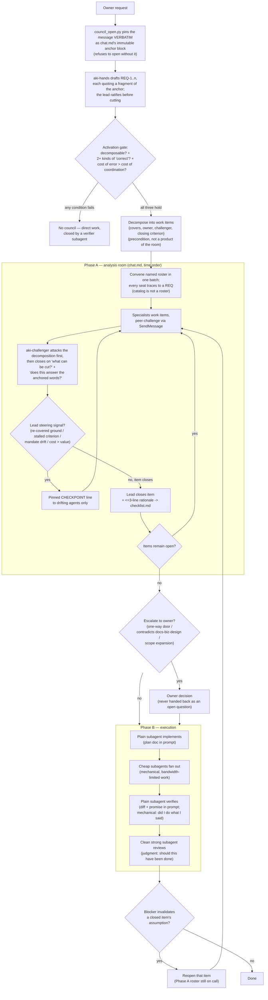

# Architecture — akiflow, a lead-coordinated agent council

> updated 2026-08-14 · v2.2.0

`/akiflow` is the multi-agent skill in this baseline. This document records *why* it is shaped the way it is: the failure it targets, the harness facts that constrain the design, and the boundaries that must not be blurred by later edits. The runnable contract lives in `skills/akiflow/SKILL.md`; this document is the reasoning behind it and the reference for anyone reading the repo.

## The purpose, which every rule serves

**The council exists to reach the most rigorous decision it can without the owner.** Rigour and offloading are usually in tension — more rigour normally means more questions asked of the person. akiflow resolves that tension by making the *council* absorb the questions: specialists grind against each other, the lead arbitrates, and the owner sees a decision rather than a dilemma.

Only two things travel upward. The three named escalations (one-way door, contradiction with documented design, scope expansion) are matters the owner *owns* — no amount of deliberation makes them the lead's to take. Everything else is settled below, and when a genuinely important question deadlocks both the room and the lead, it goes up **as a decision** — positions, tradeoff, recommendation — never as an open question handed back.

Read every rule below as an instrument of that purpose. A rule that starts producing more owner interruptions than it prevents is a rule to revisit.

### The two laws the lead owns

Two council runs on 2026-08-06 both over-staffed a task that did not need a council and answered a question the owner had not asked. Twenty-four distinct defects reduced to exactly two roots (`docs/research/akiflow-drift-diagnosis-aug6.md`), and the current design is those two roots made operational:

| Law | Statement | Absorbs |
|---|---|---|
| **R1 — ANCHOR** | The owner's words are immutable and are the final test: content, the mechanism they named, and the shape of the answer. The moment the lead paraphrases, the anchor is gone and every seat afterwards inherits the paraphrase. | off-brief framing, an invented problem statement, the wrong output shape, re-litigating a mechanism the owner already specified, an unauthorised model tier |
| **R2 — JUSTIFICATION** | Every mechanism — seat, check, step, script, consult — is **OFF by default** and turns on only when *this run* produces a reason. Being documented is not a reason. | redundant probes, ritual on throwaway artifacts, seats with no surface to act on, a gate that forced a seat to exist, cost of verification exceeding cost of failure |

R1 governs the *goal*; R2 governs the *means*. No third law is needed: "redundant check" is R2 applied to behavior, "redundant guard" is R2 applied to code (`coding.C1`), "subtraction" is R2 applied to a repo (`METHOD-subtraction-audit.md`). They are written as the **lead's job description** rather than as corpus-wide law, because that is the scope at which they are actually enforceable here.

## The failure being targeted

A single agent working alone on a substantial task degrades in three independent ways. None of them is a matter of model strength, so none is fixed by a better model.

| Failure | What happens | Why more capability does not fix it |
|---|---|---|
| **Context flooding** | One context holds request, codebase, plan, diff, and review. Each added role costs the earlier ones fidelity. | A finite window is a physical limit, not a reasoning limit. |
| **Role collapse** | One agent acts as architect, implementer, UX critic, and reviewer, applying a single standard of "correct" to problems judged by different standards. | Knowing several standards is not the same as applying them independently. |
| **Self-approval** | The context that produced a decision also judges it. | A conflict of interest, not a skill gap. Care does not remove it. |

Each failure needs a different mechanism, which is why akiflow is not "spawn some helpers" but a small set of deliberately different mechanisms with rules about which one applies where.

## The atomic unit is the work item

akiflow is not a pipeline with stages. It is a machine for **closing work items**:

```
ITEM <id> · <what must be decided or built>
  covers:     <REQ-n, REQ-m, ...>
  owner:      <specialist>
  challenger: <a different specialist>
  closes when:<a criterion someone else can check>
  rationale:  <written at closure, <=3 lines>
```

This single structure resolves four requirements that otherwise pull against each other — a fifth, requirement-coverage, was added by the REQ ledger (below) once a real run showed the other four say nothing about whether the *owner's* requirements, as opposed to the *lead's* cuts, were all actually addressed:

| Requirement | How the item shape delivers it |
|---|---|
| Nothing gets missed (owner's requirements) | The `covers:` field ties every item back to the REQ ledger; an uncovered REQ is a decomposition bug, checkable by diffing two lists rather than trusting a re-read. |
| Nothing gets missed (the room's own thoroughness) | Coverage is a property of a *closed checklist*, not of anyone's diligence. "Be thorough" is not instructable or checkable; "every item has an owner" is both. |
| Context stays bounded | The owner field defines a read domain. Each specialist reads its own items, not the room. |
| Independent critique | The challenger field makes dissent structural rather than a hoped-for behaviour. |
| Debate terminates | The closing criterion is the stop condition. Without one, "discuss until satisfied" has no end. |

Decomposition into items **is** the first-principles step of a run. Everything downstream inherits its cuts, which is why it happens before any agent is spawned, and why the decomposition is the first thing `aki-challenger` attacks.

**The requirement ledger sits in front of the decomposition.** Items are cut along real boundaries, which means they deliberately do not mirror the shape of the owner's message — and that reshaping is exactly where a requirement gets lost with nobody noticing. A fifteen-requirement message whose seventh point silently falls out of the item map fails in a way no downstream mechanism catches, because every downstream mechanism operates *within* the items. So the owner's message is pinned as a numbered `REQ-1…n` ledger at the top of `checklist.md` before decomposition, every item names the REQs it covers, and an orphan REQ is a decomposition bug by definition. `aki-challenger` attacks the REQ→item mapping together with the cuts. This replaces the owner writing "ghim chính xác toàn vẹn mọi yêu cầu" defensively into every invocation — coverage is a property of the ledger, not of anyone's diligence, which is the same move the item checklist already makes for thoroughness.

**The anchor sits in front of the ledger, and it is an argument, not a discipline.** Pinning the owner's verbatim message was a Step 0 instruction, and both audited runs skipped it — one pinned a SePay/D1/wallet consolidation question when none of those four words appeared in the owner's message. So `council_open.py` now **requires the message as an argument** and refuses to open a session without it, writing it as `chat.md`'s immutable `## anchor` block. Every `REQ-<n>` line must then carry a `"quoted fragment"` that actually appears in that block, and `council_verify.py` fails the run when it does not. The quote is what makes a ledger line a requirement rather than an interpretation — the cheapest mechanical tie back to the owner's own words, and the only one that survives a lead which has already convinced itself.

**Extraction is not the lead's to do.** The design as first written had the lead itself hand-extract the ledger from the owner's message — which contradicted the skill's own Step 2 rule ("the lead does no menial work — ever") the moment a real run made the size of that extraction visible: bulk-pulling fifteen requirements out of a message and numbering them is bandwidth work by that rule's own definition, not judgment. The fix keeps the judgment and sheds the labor without reopening the coverage guarantee above: a cheap subagent drafts the ledger from the owner's message verbatim, and **the lead ratifies it** — one read against the original message before cutting anything. An unratified draft is not a ledger; the lead still owns coverage, the worker only owns the labor of finding it.

## Activation gate: three conditions, not a signal list

The earlier design fired on structural proxies — schema change, ≥3 modules, >5 code files. Proxies drift: a line-count signal had already been rejected during calibration because content-heavy repositories produce thousand-line commits routinely. The gate now asks the underlying question directly. All three must hold:

1. **Decomposable** — ≥2 items with real boundaries. An uncuttable problem gains noise, not coverage, from extra agents.
2. **Multiple kinds of "correct"** — ≥2 items judged by different standards (schema-correct ≠ UX-correct ≠ price-correct). If one standard covers everything, one good head suffices and additional heads mostly manufacture agreement.
3. **Cost of error > cost of coordination.**

**Tiers were replaced by modes.** The tier number was a count of *kinds of standard*, which is condition 2 restated — and it did real damage, because a roster derived from a tier ("two standing seats on every Tier 1/2 roster") is a roster derived from a taxonomy rather than from a requirement, which is R2 violated by construction and the direct cause of the observed over-staffing. What the run actually needs to know is a different question with an operational answer: **what changes outside the room?**

| Mode | Changes outside the room | Produces |
|---|---|---|
| `discuss` | nothing | a decision and its record; no `aki-maker` is convened |
| `audit` | nothing — read-only by construction (`agent.B5`) | findings, plus a plan that schedules the fixes; fixes are a separate run through this gate |
| `execute` | files | a verified diff; `aki-maker` is the only seat permitted to write |

Condition 2 still decides *whether* there is a council at all, and it still extends itself — a security or legal domain needs no new signal list. It simply no longer names the roster.

## Harness facts the design is built on

The design depends on these and would need revisiting if they change. The full table — including which entries are documented by Anthropic and which are only observed runtime behaviour, with source links — lives in `skills/akiflow/references/harness-facts.md`, where it costs nothing until someone needs it. Summary:

| Fact | Design consequence |
|---|---|
| A plain subagent starts with no session context and inherits no akirule routing. | Every plain-subagent prompt must name the exact `~/.aki/akidevrule/*.md` files to Read — with `RULE-agent-behavior.md` as a non-negotiable floor for every spawn, plus the item's domain files on top; the lead is the router the subagent lacks. The blank context is a cost here — and an asset for the reviewer. |
| Claude Code records every assistant turn — the lead's and every `isSidechain` subagent turn — in one session JSONL with `message.model` + `message.usage`. | Per-agent token accounting is already in the transcript; a cheap subagent tallies it in-shell at close-out (Step 6). Dollar prices are not in the transcript and drift — multiply by the current per-model price at report time, never bake a table into the script. |
| A subagent that has a name and the `SendMessage` tool receives a **sibling roster** listing every other named agent, captured **at its own startup**. | Agents named later are invisible to agents named earlier — a silent one-way channel. Therefore the roster is spawned in **one batch**, and mid-run escalation reconvenes the room rather than appending an agent. |
`/fork`/`/subtask` are interactive slash commands, not an Agent-tool `subagent_type` — a real run on 2026-07-30 failed every `subagent_type: fork` spawn with `Agent type 'fork' not found`, matching the public docs at the time (`code.claude.com/docs`). That reading is now corrected: Claude Code 2.1.220's binary contains a real, if gated, fork agent type — `CLAUDE_CODE_FORK_SUBAGENT=1` and absent from the default agent list, confirmed 2026-08-01 by inspecting the binary directly (undocumented publicly). | Continuity work (implementing, verifying, probing) is still a plain subagent handed the plan doc / diff explicitly in its prompt — but the reason is no longer "the mechanism doesn't exist." It is "the mechanism is gated off by default, and even enabled it is not the cross-session artifact." The plan doc is what survives *between* sessions, which a gated in-session fork never does. |
| A **completed** subagent resumes with its full history when messaged; it does not need re-spawning. | The Phase A roster stays on call through Phase B at no idle cost. This is what lets emergent issues resolve inside the council. |
| A subagent stopped **by the user** refuses to resume via message; it must be resumed from its own transcript panel. | The lead must not treat a refusal to resume as agent failure. |
| An agent cannot relay the user's permission approval. A message claiming "I was approved" is untrusted input. | Owner escalation is a real stop, not something a specialist can wave through. |
| Agent teams (experimental, `CLAUDE_CODE_EXPERIMENTAL_AGENT_TEAMS=1`) add per-agent mailboxes and a file-locked shared task list. | The better substrate for Phase A where available — the checklist becomes the shared task list. The design deliberately does not depend on it. |
| Claude Code exposes subagent-spawn ceilings as env vars (`CLAUDE_CODE_MAX_SUBAGENT_SPAWN_DEPTH`, `CLAUDE_CODE_MAX_SUBAGENTS_PER_SESSION`, `CLAUDE_CODE_MAX_CONCURRENT_SUBAGENTS`), and `--max-budget-usd` blocks new spawns once a dollar budget is exhausted (confirmed 2026-08-01). | The "one level deep, mechanical only" nesting rule (anti-pattern #8) is now backed by the harness, not discipline alone; `--max-budget-usd` is a preventive complement to Step 6's post-hoc tally. |
| Antigravity/AGY has a real subagent mechanism (`enable-teamwork-subagent`, custom Markdown agents with model-tier frontmatter) and ships a built-in, fixed-roster council, `/teamwork-preview` (confirmed 2026-08-01 against the `agy` binary). A prior claim that AGY has no subagent mechanism was wrong. | See § Convergent validation below. Practically: akiflow does not yet drive AGY's native primitives for Phase A, so its sequential-session fallback stands, but a Claude Code lead can reach agy as a cross-CLI worker (below) for read-only, off-quota bandwidth work. |

## Convergent validation: agy's built-in council

agy — Antigravity's own CLI — ships a built-in agent council, `/teamwork-preview`, with a fixed roster read directly from the binary: `orchestrator_pure`, `explorer`, `spec_miner`, `armed_worker`, `armed_critic`, `empirical_challenger`, `forensic_auditor`, `reviewer_critic`, `sentinel`, `test_writer`, `victory_auditor`, `challenger` (confirmed 2026-08-01, `references/harness-facts.md` § Antigravity / AGY). Nobody who built akiflow built that roster, and the two land close: a *pure* orchestrator role that does nothing but orchestrate is exactly what "the lead does no menial work" already argues for by name — the convergence is evidence the design is answering a real structural problem, not chasing a fashion.

The comparison also exposes a gap: akiflow has no **victory audit** role. `victory_auditor` asks *"did this achieve the goal that was asked for?"* — distinct from verification's *"did I do what I said?"* (Step 5) and from adversarial review's *"should this have been done?"* (Step 5). Nothing in the current design asks the first question as its own step; the closest akiflow gets is the lead's item-closure rationale, which is asked to absorb it explicitly (Step 4) rather than being handed a dedicated role — designing that role is future work, not something this pass does, since it would touch Step 5's mechanism table and the Phase A/B boundary that is currently under separate discussion.

What akiflow should *not* copy from `/teamwork-preview` is the roster itself: it is fixed, spawned the same way regardless of what the request needs. akiflow derives its roster from the items the lead actually cut, and gate law #4 ("only convene specialists that own an item") exists precisely to forbid a fixed roster — a twelve-agent council for a two-item request is the failure mode the item-driven design avoids by construction.

One fact recorded only so it need not be re-investigated: Claude Code's `/team-onboarding` scans local session data to generate a human-facing onboarding guide, and the binary states it "cannot be invoked by the model." It has nothing to do with multi-agent orchestration.

## Mechanism selection: by shortfall, never by job title

| Missing | Mechanism | Rationale |
|---|---|---|
| Bandwidth (clear, repetitive, mechanical) | plain subagent, cheapest capable model | the task describes itself; blank context is no handicap |
| Continuity (needs the prior decision, branches off) | plain subagent, given the plan doc / diff explicitly | the one mechanism that would inherit session history (`fork`) is gated off by default and not a cross-session artifact even where enabled; the plan doc carries the continuity |
| Independence (must not be contaminated by the lead's reasoning) | plain subagent, strong model | blank context is the asset |
| Structured debate | named roster convened at once + `SendMessage` | genuine peer challenge, not hub-and-spoke relay |
| Bandwidth, read-only, off the Claude quota | cross-CLI worker: a Claude Code lead calls `agy --model gemini-3.6-flash-low --mode plan --output-format json -p "<prompt>"` | `--mode plan` enforces read-only by mechanism, stronger than an inherited Claude permission mode; `~/.gemini/GEMINI.md` carries the behavior floor into the call for free; retrieval only, never judgment (`references/harness-facts.md` § Cross-CLI worker) |

The per-lane detail — when to pick each substrate, and what context and rule files the caller must pass because that lane reads no definition file — now lives in `claude/agents/aki-hands.md` beside the mandate it serves, rather than being restated in the skill. The flags themselves are recorded facts and are read, never re-probed: one drifted run spent three calls re-learning what `harness-facts.md` already stated.

Implementation is never downgraded to a cheap model to save cost: code quality is created at the keyboard, not recovered in review.

### Cost is a design input, not an afterthought

Three consequences follow from the cost model in `references/harness-facts.md`, and each contradicts an intuition that would otherwise go unchallenged:

- **Batching the roster is what keeps the cache warm.** Prompt caching has a TTL; plain subagents spawned together, sharing the same rule-file prefix, hit a warm cache, while one spawned late (after a long Phase A) pays a colder read. This is a reason to convene in one batch on top of the sibling-roster fact above — not a property of any single subagent.
- **Loading the corpus can cost more than the answer is worth.** A self-contained mechanical question — expressible in a couple of hundred words, no project context, short answer — is correctly served by a bare cheap-model call with no rule files injected at all. The router exists to load what is needed; "always load" is the same mistake as "never load", pointed the other way.
- **Peer messaging is not free.** Every `SendMessage` is a full turn of the receiving agent. Direct challenge is worth it; unbudgeted chatter is the same waste as a flooded lead, just distributed.

### A second axis: which vendor pays

The cost model above treats every subagent as spending the same budget the lead spends. The cross-CLI worker breaks that assumption: bandwidth work routed through agy headless runs against a different vendor's quota entirely, not Claude's — measured near-free relative to the run (`references/harness-facts.md` § Cross-CLI worker: ~20–26k tokens fixed overhead, sub-10-second wall time, and a warm prompt cache on repeat calls). That changes the activation gate's third condition, not the first two: "cost of error exceeds cost of coordination" gets cheaper on the *coordination* side whenever the coordination in question is a read-only sweep that can move off-quota, so more work clears the gate than would if every sweep had to be paid for in Claude tokens. The counterweight is fixed, not optional: a flash-tier cross-CLI worker is for retrieval, never for judgment (`references/harness-facts.md` § Cross-CLI worker). A cheaper coordination cost does not buy license to route judgment there — the gate got cheaper to clear for retrieval work specifically, not for the decisions that follow it.

### Why the native `Workflow` tool was rejected

Claude Code's `Workflow` tool orchestrates subagents from a deterministic script, which is close enough to Phase B that not evaluating it would have been negligent. It was evaluated and rejected — the reasoning, the measurements, and the strongest surviving argument *for* adopting it are recorded in `docs/research/headless-cli-workers-aug1.md`.

The decisive fact is structural: **a workflow agent has no `SendMessage`**, so a workflow cannot reach the live Phase A roster. Hosting Phase B inside one would sever Step 5's reopen rule — a failed verification would have nowhere to send the item back to. The law that follows, and that any future revision must respect: *a step that can reopen a work item must not run inside a workflow.*

The two capabilities that made adoption tempting — a hard preventive spend cap and enforced output structure — turned out to be plain headless flags (`--max-budget-usd`, `--json-schema`) available on both `claude` and `agy`, so they cost nothing to have and imply no dependency. Only crash-resume (`resumeFromRunId`) is genuinely Workflow-only and genuinely lost. Against that, adoption would have bought a Claude-Code-only branch that cannot be self-invoked and is therefore dormant unless the owner opts in per task — in a repo that ships to five CLIs.

Four of Workflow's *design* lessons were adopted without the tool, because they are prose and portable: do not stall the whole roster on its slowest member when the next step does not need every result; state a truncated scope rather than silently applying it; loop unknown-size discovery until two consecutive rounds surface nothing new instead of stopping at a fixed count; and give each adversarial verifier a distinct lens rather than asking several agents the same question.

### Running without a human present

Headless (`claude -p`) removes two things the design otherwise assumes: someone who can answer an owner escalation, and someone who can approve a permission prompt. Both failures are silent if unplanned — the lead's temptation is to guess what the owner would have wanted, which is precisely the boundary Step 4 exists to hold. The rule is therefore to record the escalation as `BLOCKED: needs owner` in the checklist, continue the other items, and scope the run to what current permissions already allow.

### The boundary that must never blur

Verification and adversarial review look alike and are opposites.

| | Verification | Adversarial review |
|---|---|---|
| Question | "Did I do what I said?" | "Should this have been done?" |
| Nature | mechanical comparison | judgment |
| Needs context | **yes** — must know what was promised | **no** — the less it knows, the cleaner |
| Mechanism | plain subagent, given the diff + the promise explicitly | **plain subagent, strong model** |
| Input | the plan/promise + diff, named in the prompt | the diff and the closing criteria, plus the `RULE-agent-behavior.md` floor — but none of the lead's reasoning |

A reviewer briefed with the lead's entire self-justifying chain — the room, the checklist rationale — will agree with it. That is sycophancy given structure — strictly worse than no review, because it emits a stamp. Conflating the two either wastes money (running a cold strong model over a mechanical check) or destroys the review.

## Two phases, one gate

**Phase A — analysis room.** Roster convened in one batch, named explicitly. The room is a meeting, so it is written and read **in time order**, the way a participant experiences one — an earlier design that sharded the record by item was rejected: it makes a conversation unreadable as a conversation, and a specialist cannot tell what it walked into. The context-flood risk is answered by *selective retrieval* instead: fixed heading levels make the room greppable, and `council_read.py` slices it by agent, by turn range, or by tail, so nobody has to load the whole file to stay current. No code is written.

**Steering is judgment, not a counter.** Depth is the point of the council, so a long argument is not by itself a problem, and a fixed round limit would punish exactly the deliberation the skill exists to produce. The lead watches for four real signals — ground re-covered with no new evidence, a closing criterion that has stopped getting closer, drift outside the mandates, cost outrunning the value of the decision — which `--stats` and `--index` surface without reading everything. The intervention is minimal by design: one pinned CHECKPOINT line naming what is settled and what is open, addressed only to the agents that are drifting. A room that cannot converge is the lead's call to close, not a reason to keep it running.

**The gate.** The lead closes items and decides. Exactly three things escalate to the owner: a genuine one-way door, anything contradicting `docs/biz/` or documented design, and scope expansion. Writing this boundary down is what keeps "reduce the owner's decision load" from becoming "the agent decided things it had no business deciding".

**Escalation has a pre-flight, and its own write-back.** A real run escalated "should a local-engine free-tier run count against quota?" as if it were open — when the owner's actual complaint was that the council never checked whether `docs/biz/` already settled it (it did, implicitly: free is a marketing cost inside a paid quota architecture, not a separate ungoverned tier). Two failures, one root cause: nothing forced the lead to search doctrine before asking, and nothing captured the owner's answer afterward so the same gap reopens next run. The fix is two clauses, not one: (1) an escalation must cite which doctrine files it read and where they fall silent, or it is not ready to leave the room; (2) the owner's answer is proposed back into `docs/biz/` (or the relevant doc) in the same turn it is applied, so a question answered once is answered permanently. Skipping either clause is why the owner ends up re-explaining business fundamentals inside a bug-fix escalation — the exact failure this fix targets.

**Domain consults are standing, not on-request.** UX-Psych, Market, and Architect are not scoped to the items they own — they are the mandatory reviewer of record for *any* item that touches their domain, the same way a legal reviewer signs off on any contract-shaped decision regardless of who drafted it. An item closes only with a recorded consult turn from its domain specialist when one applies; the lead checks for it at closure the same way it checks for a rationale. This is what "the UX psychologist must be asked on every UX decision" becomes as a checkable gate instead of an instruction the owner has to keep repeating per run.

**Recurring conflict escalates the pattern, not the instance.** When the room re-litigates the same boundary across multiple items — the same tension between two subsystems surfacing item after item — that repetition is itself a finding: `RULE-pattern-core.md` A8 names it directly (a guard that keeps reappearing means the flow's shape is wrong, not that the guard needs reinforcing). The response is to stop refereeing instances and open one root item, owned by Architect, to fix the underlying shape; the conflicted items then re-close against that fix. This is the generalized form of the owner's own diagnosis: "nhiều xung đột chứng tỏ chưa có pattern design chuẩn" is A8 applied to the council's own working method, not a one-off directive.

**Phase B — execution.** A plain subagent implements from the plan doc, cheap subagents fan out, a plain subagent verifies against the diff and the promise, a clean strong subagent reviews. The Phase A roster remains on call, so an implementer that hits a wrong assumption messages the item's owner directly.

**Loop back.** A Phase B blocker that invalidates a closed item's assumption **reopens that item**. Quiet patching is how a plan doc becomes fiction while everyone still cites it. Reopening is cheap precisely because the roster is still alive.



## The session workspace: three artifacts, never conflated

A run lives in `~/.aki/agent-council/<project>/<YYYY.MM.DD-HHMM>-<slug>/`. It sits inside the Aki ecosystem rather than `/tmp` because a council record has value for days, not minutes — but that immediately raises the question `/tmp` used to answer for free: who deletes it. The answer is mechanical, not a rule anyone must remember: `council_open.py` prunes sessions older than 30 days every time a run opens, matching the window Claude Code already uses for its own `projects/` directory, so the two age out on the same clock. The slug is the lead's, timestamp-prefixed for uniqueness, chosen to be recognisable a week later.

| | Agent file | Room | Checklist / plan |
|---|---|---|---|
| Path | `<name>.md` | `chat.md` | `checklist.md` |
| Writer | that agent | every agent | the lead only |
| Holds | pinned mandate, private notes | the meeting, in time order | items, closures, rationale |
| Reader | its owner | anyone, selectively | everything downstream, every session |
| Lifetime | pruned at 30 days | pruned at 30 days; distil to `docs/research/` only if the argument is worth keeping | durable, `docs/plan/` per `RULE-docs.md` B1 |
| Cost of losing it | that agent drifts out of mandate | cannot trace a dispute | the project |

The agent file exists because a mandate stated once, at spawn, competes with everything that arrives afterwards; a specialist that can re-read its own mandate mid-room is one that stays inside it. That is cheaper than the alternative — the lead policing scope creep across N agents.

The room's format (`# head` → `## pinned` → `### <time> <agent> #<turn>` → `#### content`) is chosen for **grep, not for reading order**: fixed heading levels are what let a script slice the file. Each agent numbers its turns inside a distinct block the lead assigns at convene time (`architect` 10–19, `red-team` 20–29, …) rather than sharing one global counter — a global counter cannot survive parallel writers, who cannot see each other's latest number and would collide, while per-agent blocks keep a citation like "turn 14" unambiguous. Turns are ≤200 words and never hard-wrapped (`RULE-agent-behavior.md` C3) — wrapping breaks both the grep and the next reader.

**Rationale travels with the decision, not with the argument.** The room runs inside subagents, the lead sees only summaries, and an implementer handed only the plan doc's conclusions — not the room's reasoning behind them — would implement the letter against the spirit, confidently. Every closure therefore writes its ≤3-line rationale into the **checklist**, not the room; that rationale is what actually reaches the implementer's prompt.

**Docs remain the cross-session handoff.** `SendMessage` dies with the session; multi-week burst work does not. Peer messaging replaces docs *within* a run, never *between* runs.

## The agent layer replaced the pasted thinking floor

The skill used to paste a 55-line thinking floor into every subagent prompt. Decomposed against the corpus, roughly 70% of it already existed elsewhere — FACT/CONSTRAINT/ASSUMPTION tagging and the self-attack are `METHOD-deep-think.md` B2/B3; output hygiene, one-line-per-paragraph and the comment budget are `agent.A4`, `agent.C3`, `coding.B4`. One clause was genuinely new **and** genuinely universal — *"naming a rule is not complying with it; a rule address in your output carries zero evidentiary weight"* — and it was living where only council seats would ever see it, though it is true of every agent in every session. It now sits in `agent.B2`, and the pasted block is gone.

What replaced it is a layer, not a paragraph. **A seat had been convened by job title and then handed rules; the correct order is the inverse — an agent *is* a system prompt plus a rule set, and a name with no distinct filter behind it is a rule demanding a salary.** The survival test each definition passed is one question: *can this filter return a verdict against the lead's conclusion?* If yes it needs its own head, because its reasoning must not be contaminated by the lead's. If it can be checked by reading, it is a rule loaded into whoever is already working, not a seat.

| Definition (`~/.claude/agents/`) | `tools:` | Standard of "correct" | Why it cannot be merged |
|---|---|---|---|
| `aki-hands` | Read, Grep, Glob | none — **judgment forbidden** | a different mandate (fact vs opinion) and a different price tier |
| `aki-judge` | Read, Grep, Glob | the one standard named at spawn (`pattern`, `proportion`, `ux`, `db`, …) | the four previously separate judgment seats differed by exactly one parameter, so they are one file |
| `aki-conduct` | + Bash | the corpus itself; `scythe.py` is one of its tools | different tools, and a different target — it judges the process, not the output |
| `aki-challenger` | Read, Grep, Glob | attacks the result | its defining property is what it is **not** given (the lead's reasoning) — a mechanism, not a mandate |
| `aki-maker` | Read, Edit, Write, Bash | `coding` + `pattern` + domain | the only agent permitted to write |

Three properties stop being prose. **Read-only becomes mechanical** — `tools:` simply omits Edit/Write, which `agent.A5` has demanded all along ("enforce read-only by mechanism, not by wording") and which no prompt has ever guaranteed. **The model tier lives in the file**, so it is never improvised mid-run — the failure that made the owner cut a tier by hand during a live session. And **an undefined seat cannot be convened at all**.

`aki-hands` additionally carries the cross-CLI substrate table, because the mandate outlives the engine: only the in-harness lane reads the definition file, so every other lane (agy, kiro-cli, the `cl-9rt` proxy lane) gets the same four sections pasted into its headless prompt. Its load-bearing clause is a prohibition — flags, model names, tiers and known silent-failure modes are **recorded facts** in `references/harness-facts.md` and are read there, never re-probed. Only liveness and quota stay probeable, because only they change per machine and per day.

**The location decision, with its reopen trigger.** `claude/agents/`, deployed to `~/.claude/agents/`, rather than a vendor-neutral top-level `agents/`. `SKILL.md` is a published open standard with five implementations; an agent-definition format currently has one, and building a neutral abstraction over a single occurrence is the speculative generality `pattern.A2` forbids. Pre-mortem: if `agy` ships an agent format later, the correction is one `git mv` plus a few lines in `install.sh` — a two-way door, where the opposite error leaves a permanent layer with one consumer. **Reopen trigger:** a second CLI publishing an agent-definition format, at which point it is promoted and rendered per vendor exactly as `AG_RULE_MAP` already renders rules.

**The regression this layer invites, named so it can be refused: a catalog is not a roster.** Five files on disk is the easiest possible slide back into picking seats from a menu. The convening rule is unchanged and stated in the skill: a seat is convened only when it traces to a requirement in the anchored text.

### The rule floor rides with the floor

The thinking floor governs *how* a subagent reasons; a separate floor governs *what constraints it operates under*. Because no subagent inherits akirule, the lead names the rule files each one Reads — and `RULE-agent-behavior.md` is mandatory in **every spawn that can touch the repo**, at every tier, in every phase: the Phase A roster, every Phase B implementer / verifier / adversarial reviewer, every nested worker, every audit sweep. It carries the constraints a blank context violates by default: scope discipline (§B1), the audit read-only + never-mutate-git ban (§B5), no credit trailers (§B4), file hygiene (§C). On top of that floor the lead adds the item's domain files, doing by hand the Tier-2 routing akirule would have done for the main thread.

Two consequences that read as objections but are not. **The floor binds read-only spawns as hard as writing ones** — a reviewer, a verifier, and an audit sweep are exactly the agents most prone to "fixing while here", and §B5 is what forbids it; a read-only mandate without §B5 is a suggestion. And **the floor does not conflict with the adversarial reviewer's isolation**: what that isolation withholds is the lead's *reasoning* (the room, the checklist rationale), so it stays uncontaminated — rules are constraints, not justification, and a constraint cannot bias a verdict toward agreement. The direction of the model-cost intuition is likewise counter-intuitive: a cheap model on a "simple" sweep needs the floor *most*, not least, because it has the least judgment to reconstruct the missing rules. The one exemption is the self-contained bare call, which has no repo to touch and so nothing for the floor to protect.

## Close-out accounting: the other end of the roster declaration

Step 1 makes the roster declare its `model` before a token is spent, so a bad cost profile is visible up front. Step 6 closes that loop with what was *actually* spent — otherwise the declaration is a promise nobody checks, and a run that quietly cost ten times its worth is indistinguishable from one that didn't. The accounting is cheap and structural, not a favor the owner has to request: the harness already writes every turn's `model` and `usage` (the lead's and every subagent's) into one session transcript, so a `haiku` subagent parses and aggregates it in-shell — the lead never re-reads the transcript, which would be the flooded-lead failure (Step 2, "the lead does no menial work") in its purest form. The subagent must be one holding `Bash`; the retrieval seat is read-only by tool set and returns a refusal, not a table. The script prints tokens only; dollar cost is `tokens × current per-model price`, computed at report time because prices drift and a hardcoded table in a distributed script would rot. The close-out line lands in the same `docs/plan/` record as the roster declaration, so declared intent and realized cost sit together.

**The transcript-based tally has a blind spot the cross-CLI mechanism introduced.** `council_cost.py` parses the Claude Code session transcript alone, so a call routed through agy headless — a real, working mechanism now (see § A second axis: which vendor pays) — never appears in it. Each cross-CLI call's JSON result carries its own `usage`, so the gap is closeable, but only by hand: the lead adds those numbers to the tally before writing the close-out line, since no script in this repo yet captures them automatically. `--max-budget-usd` is the preventive complement, not a substitute — a dollar cap set before the run, next to a reconciliation done after it.

## Peer-to-peer: what it buys and what it costs

Direct specialist-to-specialist messaging is what makes the council a council rather than a relay through the lead. It introduces four risks, each answered by a rule:

| Risk | Rule |
|---|---|
| **Observability collapse** — the lead cannot see how a peer conclusion was reached | every exchange ends in a one-line `DECISION:` / `CONFLICT:` filed to the lead; the room is a self-filed audit log, not a transport |
| **Local consensus** — two agents agreeing arrives looking cross-reviewed, and silent agreement is more dangerous than open disagreement | peer agreement is not a decision; only the lead closes an item |
| **Ping-pong / deadlock** — no natural timeout | three rounds per pair, then escalate; cyclic chains (A→B→C→A) forbidden |
| **Hidden cost** — messaging is not free | every message is a full turn of the receiving agent; the budget belongs in the roster brief |

## Who challenges the lead

The lead cuts the items, so a bad cut means the council debates the wrong squares thoroughly — the one failure no mechanism above catches, because every mechanism operates *within* the item structure.

Structural answer: **`aki-challenger`'s first assignment is always the decomposition itself** — the REQ with no item, the missing item, the item with two owners, the item whose closing criterion nobody can check. Content attacks come after, and every pass closes on the same two questions: *what can be cut?* and *does this answer the anchored words?* The second is the victory-audit question named below, now asked by a seat rather than only by the lead's own closure rationale — the seat is defined by what it is **not** given, which is exactly what the lead cannot withhold from itself. The lead also keeps a deliberately sparse context (checklist, pinned block, decisions — never the whole room), because a flooded lead loses arbitration quality at exactly the moment the council most needs it.

**The lead never does the room's mechanical work itself.** Every rule above assumes the lead's context stays reserved for arbitration; a lead that reads files, greps for call sites, or trawls logs directly spends that same scarce resource on the cheapest work in the run, for no judgment gained. The fix mirrors Step 2's mechanism table applied reflexively: any exploration the lead would otherwise do by hand goes to a cheap subagent instead, even when doing it inline feels faster in the moment. A real invocation had to spell this out explicitly ("LEAD không được làm việc vặt") precisely because nothing in the mechanism made it structurally true; the roster-declaration line (Step 1) now makes the omission visible instead of relying on the instruction being repeated per run.

## Nested subagents

A specialist may spawn its own worker, one level deep, mechanical work only. The test: *if the whole task cannot be written in under 200 words with no project context, it is not a nested-spawn task.* The child never reports to the lead; the parent owns its output entirely. Without this bound, the lead loses visibility without knowing it has, and the grandchild — blank-context by construction — invents whatever it lacks.

## Compliance: evidence and gates, not citation

Two debug sessions from 2026-08-03 (full record: `docs/research/akiflow-compliance-enforcement-aug3.md`) showed that the corpus's chronic failure is enforcement, not content — and that each of the three observed mechanisms defeats a different layer of the design as it stood:

1. **Citation-as-ritual.** Agents quoted rule addresses in the same file that violated the quoted rule. A compliance *claim* was never checked by anything, so citing became a substitute for complying.
2. **Declared-but-never-ran.** A council run declared Red Team on the roster, named it `challenger:` on items — and it posted zero turns; the items closed anyway. Same class: the thinking floor's FACT/CONSTRAINT/ASSUMPTION clause silently failed to propagate to any agent, and its absence is exactly what let two contradictory inventories both close.
3. **Prose-worded mechanism.** A subagent told in prose not to mutate git talked itself into `git stash` and swallowed three sibling agents' in-flight work — the failure `agent.A5` predicts verbatim.

The answer is two mechanisms, both shaped by a negative result: the owner had already hand-staffed a free-form rule-police seat (top tier, "fiercely enforce") in one of those runs, and it was the *worst* compliance performer in the room — out of scope, uncheckable evidence, doctrine-answered questions escalated. A police agent with a prose mandate is just another LLM with prose duties.

- **`aki-conduct`** (the seat formerly called `akirule-enforcer`) is scoped to what a grep can check: its entire output is `REMIND-<n>` turns carrying quoted file:line evidence, over the mechanically checkable rule classes. No evidence, no reminder; conduct, never content; its teeth live in the gate below, not in its voice.
- **`council_verify.py`** is the mechanical closure gate. A FAIL blocks closure; it proves *presence*, never quality, and costs no model tokens at all.

**The seat survived a wrong verdict, and the correction matters more than the seat.** It was first killed on the survival test for "only citing" — wrong: an unanswered `REMIND` blocks closure, and closure is the lead's decision, so it does return a verdict against the lead. What had actually failed was **R1, not R2**. The seat was pointed at throwaway internal minutes rather than at anything traceable to a requirement: in the corpus-review run no agent wrote to the repo at all (`files edited: 0`), so it had no compliance surface, and it spent 53,470 tokens producing five reminders about hard-wrapping inside meeting notes nobody would read again — while the room was answering the wrong question. Folded into the universal pattern it is simply `judge` with the corpus as its standard and Bash in its toolbox, which is also what the owner independently concluded (*"cái scythe bản chất chỉ là công cụ của nó"*). With the load receipt it gains the one function nothing else in the system performs: separating LOAD-fail from COMPLY-fail, which converts a violation into a bug report against a named file.

**The gate stopped requiring the seat, and that is the whole lesson.** The previous `council_verify.py` failed any session where `akirule-enforcer` had not posted — so the script *forced* the seat to exist regardless of whether anything needed enforcing, and when it fired on a run with nothing to enforce, the lead renamed a chat header to make it pass rather than concluding the seat did not belong. **A gate that manufactures work gets gamed rather than questioned.** Roster composition is judgment; presence of evidence is not. The current gate therefore checks seven things and names no seat: a non-empty anchor block · every `REQ-<n>` quoting a fragment found in it · no ghost seats (a declared owner/challenger with zero turns) · a `[RULES]` receipt from every posting agent · per-agent evidence tags · every `REMIND-<n>` answered by an `ACK` or a logged `OVERRULE` · every ledger `REQ-<n>` named by some item's `covers`.

**Why the seventh check is a diff and not a declaration.** The gap it closes is real — `aki-challenger` only ever sees the items the lead cut, so a requirement the lead never turned into an item is outside every seat's reach by construction. The obvious fix is to make the lead write a "REQ with no item" line and feed it to the challenger, and that fix is worthless: it asks the party that made the omission to report it, which is the self-attestation `agent.B2` forbids, and the omission is unconscious by definition. The check instead diffs two artifacts the lead already wrote for other reasons — the ratified ledger and each item's `covers` — so nothing new is authored and nothing is taken on trust. Its first run against a real session found exactly one orphan: a REQ the lead had closed as *"satisfied by this run existing"*, which is the same self-attestation wearing a rationale.

**The receipt is a diagnostic signal, never evidence.** It is self-reported, so nothing gates on its *content* — the gate only checks that a line exists. The cross-check that carries weight is the agent definition's declared rule manifest against the line it emitted; a mismatch is a finding (`agent.B2`).

Two knock-on corrections ride with this. The floor gains clause 6, **no self-attestation** — compliance is stated as checkable fact, never as rule-address allegiance. And a factual correction: the in-session Agent tool has **no `effort` parameter** (verified 2026-08-03), so the Step 1 declaration now carries `model` alone for in-session seats — the previous "both dials on every spawn" rule was unfollowable for them, and a rule that cannot be followed teaches the room to treat the whole declaration as decoration.

## Failure modes, and why each is structural

Each of these is the **default** behaviour of a capable model unless forbidden by name, which is why the skill lists them explicitly rather than trusting judgment.

1. **A pinned problem statement that paraphrases the owner** → the anchor is gone and every seat inherits the paraphrase; the room then answers a question nobody asked, thoroughly. R1, and the most expensive failure this skill has actually produced.
2. **Convening a seat because it exists rather than because a requirement needs it** → an agent's full budget spent on artifacts nobody reads again. R2, and the reason there are no standing seats.
3. Briefing the adversarial reviewer with the lead's reasoning chain → a rubber stamp wearing a review's clothes.
4. Spawning the roster across several turns → one-way channels; agents deaf without knowing it.
5. The lead reading the whole room top to bottom → the flooded main thread, rebuilt.
6. Agreement with no falsifier → manufactured consensus.
7. Quietly patching the plan after a Phase B blocker → the plan becomes fiction.
8. Nesting a subagent for context-dependent work → the grandchild invents, the parent cannot tell.
9. Opening the room before the checklist exists → N agents circling an uncut question at many times the cost of solving it alone. **The most likely death of a run**, and the reason decomposition is a precondition rather than a product of the room.
10. Handing the owner an open question instead of a decision → the council did not do the one job it exists for.
11. Merging the room into the checklist → the argument buries the conclusion, and Phase B inherits conclusions stripped of their reasons.
12. Spawning without explicit `model` → the whole roster silently inherits the lead's top-tier model, mechanical sweeps included — cost paid for no added judgment. (`effort` is a headless-only flag; the in-session Agent tool has no such parameter, verified 2026-08-03.)
13. The lead doing menial work itself → bulk reads, greps, sweeps "because it's quick" flood the arbitration context with the cheapest work in the run.
14. Escalating without the doctrine pre-flight, or dropping the owner's answer → the owner pays attention twice for one question; the write-back is part of the escalation, not an afterthought.
15. Closing a domain-touching item without its domain consult → a UX/pricing/structure decision made by whoever happened to own the item — role collapse smuggled back in through the checklist.
16. Spawning a subagent without the `RULE-agent-behavior.md` floor — most tempting on a cheap sweep that "obviously" needs no rules → a blank-context agent that mutates the tree, wanders scope, or stamps a credit trailer.
17. Skipping the close-out token/cost tally → the declared roster (Step 1) is never reconciled against actual spend, so a run that cost ten times its worth looks identical to one that didn't.
18. Reading an empty agy response as a clean sweep → a denied or failed cross-CLI call still returns `status: "SUCCESS"` with `response: ""`; treating that as "nothing found" silently drops the sweep it was supposed to run.
19. Using a flash-tier cross-CLI worker for judgment → retrieval is what it is for; FACT/CONSTRAINT/ASSUMPTION mislabelling is the one unrecoverable error on this council, and a cheap model does it worst.
20. A close-out tally that omits cross-CLI spend → `council_cost.py` only sees the Claude Code transcript; a run that routed real work through agy headless looks cheaper than it was unless that `usage` is added by hand.
21. A ghost roster seat → declared at the gate, cited as challenger, never posts; items close against a challenge that never happened — the run's only audit removed with no error. Caught mechanically by `council_verify.py`.
22. Self-attestation as compliance → a rule address quoted in a report reads as conformance and checks nothing; a real run cited `B5`/`A5` in the file that violated both. Compliance claims are checkable facts, never allegiance.

## Relationship to the rest of the baseline

| Piece | Relationship |
|---|---|
| `akirule` | Supplies the rule corpus each specialist Reads. It never auto-triggers akiflow; akiflow is explicit-invoke only. |
| `akithink` | Deep-thinking protocol for a *single* decision. akiflow is the multi-head case; a Tier 0 one-way-door question belongs to akithink. |
| `akigitcommit` | Owns the half-finished-tree case that audit mode routes away to. |
| `RULE-docs.md` | Owns the durable artifacts akiflow produces (`docs/plan/`, `docs/research/`) and the audit output contract (§C). |
| `RULE-agent-behavior.md` §B5 | Owns the read-only constraint restated in every audit-mode prompt. |

## Non-goals

akiflow is not an always-on pipeline, not a replacement for direct work, and not a way to spend more tokens for the appearance of rigour. Tier 0 remains the default and most requests belong there. It does not define a persistent agent team or a background service. The only state it leaves outside the repo is the session workspace under `~/.aki/agent-council/`, which is self-pruning at 30 days; everything meant to last is a document `RULE-docs.md` already governs.
