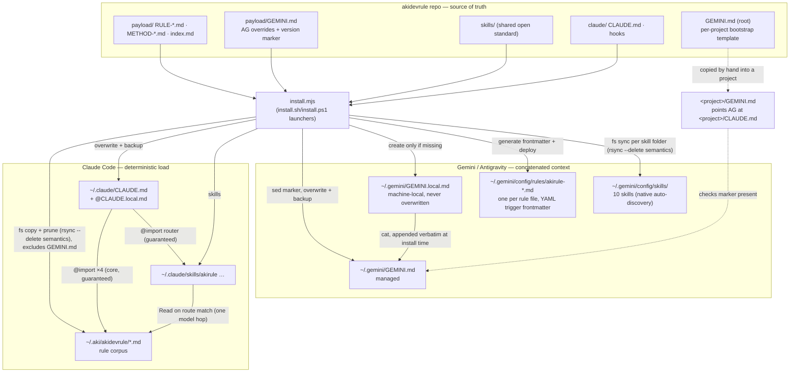
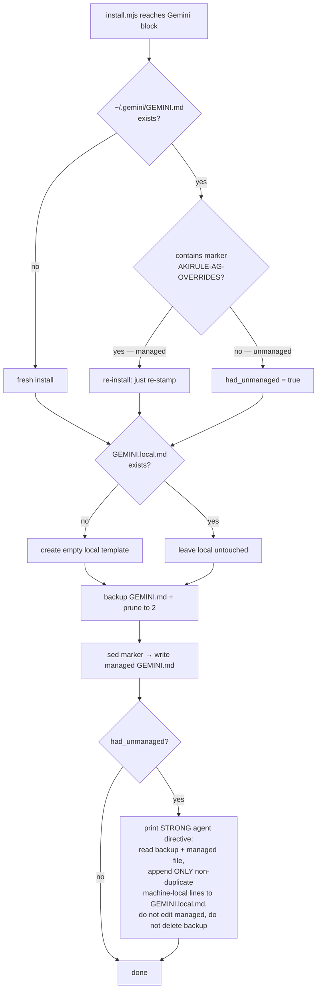

# Architecture — how rules reach the two agents

> updated 2026-09-26 · v3.4.0

akidevrule is the single source of truth for a reusable rule baseline. That baseline has to reach two different agents that load context in fundamentally different ways: **Claude Code** and **Gemini / Antigravity**. This document describes how one source is installed onto a machine and consumed by each.

## The core asymmetry

| | Claude Code | Gemini / Antigravity |
|---|---|---|
| How rule files reach the model | **Core (4 files) + router** — `@`-imported by `~/.claude/CLAUDE.md`, read by the harness at session start, no model decision involved. **Everything else** — read when the model `Read`s it on a route match (domain of the task; concept signals are evidence, not the test) | Context files concatenated and prepended to every prompt |
| Determinism | **Core: deterministic** — 0 model-dependent hops, harness-guaranteed. **Everything else: one model-dependent hop** — the `Read` of a routed file | **Deterministic for the files it auto-loads**, but any "please read file X" pointer inside them is a soft hop the model may skip |
| Consequence | Rule *content* always arrives | Rule *content* arrives only if it sits in a file the tool hard-loads — not behind a chain of pointers |

**Design conclusion:** behavior rules that Gemini/Antigravity must always obey cannot live behind a soft pointer chain. They are placed in the one file the tool hard-loads globally — `~/.gemini/GEMINI.md` — as literal content, not as a link to go fetch. The router itself is not loaded there: AG attaches each rule natively (`always_on` for `agent`, `glob` for the stacks, `model_decision` for the rest), and `always_on` stays rationed because AG gives all `always_on` rule files one shared budget of about 43 KB and silently drops whole files past it, largest first — measured 2026-09-26 (`docs/research/rule-delivery-force-load-sep25.md`); description-routed rules are never inlined and carry no size limit, they enter when the model views them. Each native description is generated from the rule's `akirule` route, so the two harnesses route from one table.

## The same asymmetry inside a skill — the description is resident, the body is not

A rule file is either loaded or not. A **skill** is split across two residencies, and the split is where the traps are: its `description:` is present in every session — that is how the model discovers the skill at all — while everything below the frontmatter loads only once the skill is invoked. A trigger word placed in a description is therefore permanently armed, and any condition qualifying that trigger, written in the body or in a rule file the router may or may not load, is usually absent at the moment the match happens.

**Rule: a trigger word in a `description:` carries its own guard, in that same line.** A guard stored one hop away is not a guard, it is a comment on one. Worked case: `/akiship` fired on the completion-intensity word `trọn vẹn` inside an ordinary question and pushed to a public remote, because the word was in the description and the "in the invocation" condition that scoped it was not — see [research/akiship-literal-activation-aug22.md](../research/akiship-literal-activation-aug22.md).

## What the source provides

```text
akidevrule/
  payload/
    index.md, RULE-*.md, METHOD-*.md   → the rule corpus (Claude Code consumes this)
    GEMINI.md                          → Gemini/Antigravity global behavior overrides (NOT a rule file)
  skills/                              → shared Agent Skills corpus (SKILL.md open standard); deployed
                                          unmodified to both agents, see docs/ref/agent-skills-standard.md
  claude/
    CLAUDE.md, hooks/                  → Claude Code-only runtime assets
    agents/                            → 5 agent definitions, deployed per file to ~/.claude/agents/
    fragments/                         → illustrative reference only, never applied manually
  GEMINI.md (repo root)                → per-project bootstrap template (copied into a project by hand)
  install.mjs                          → installer SSOT, pure Node (install.sh/install.ps1 are thin launchers)
```

Two distinct `GEMINI.md` files, different jobs:

- **`payload/GEMINI.md`** — the **global behavior overrides**. Installed to `~/.gemini/GEMINI.md`. Line 1 carries a version marker `# [AKIRULE-AG-OVERRIDES-<version>]`. Ends with `@~/.gemini/GEMINI.local.md` to pull in machine-local facts.
- **`GEMINI.md` at repo root** — a tiny **per-project bootstrap**. Copied into an individual project so Antigravity, on opening that project, is pointed at the project's `CLAUDE.md` as its source of truth. It also checks whether the global override marker is present. It is **not** distributed by the installer.

## Rule delivery — source to consumers



## Install settings preflight

Before the confirmation prompt or any mutation, the installer validates every existing JSON file it may later update: each detected Claude `settings.json`, `~/.gemini/config/skills.json`, `~/.gemini/antigravity-cli/settings.json`, and `~/.gemini/settings.json`. Each must parse with an object root; a malformed file aborts the whole install with all originals untouched. Missing files are created only after preflight. Antigravity field-only differences (`allowNonWorkspaceAccess`, `agentMode`, or `trustedWorkspaces`) still write their settings file.

## The managed / local split (both agents, same pattern)

Each agent gets a **managed** file the installer owns and overwrites, plus a **`.local.md`** sibling the installer creates once and never touches again:

| Managed (overwritten each install) | Machine-local (created once, never overwritten) |
|---|---|
| `~/.claude/CLAUDE.md` | `~/.claude/CLAUDE.local.md` |
| `~/.gemini/GEMINI.md` | `~/.gemini/GEMINI.local.md` |

The two agents join the local file differently, and the difference is deliberate:

- **Claude Code** — the managed file ends with `@~/.claude/CLAUDE.local.md`. The harness resolves the import itself, so this is a hard load, not a pointer the model may skip.
- **Gemini / Antigravity** — `install.mjs` **appends `GEMINI.local.md` verbatim** (string concatenation + write, not a shell `cat`) at install time. The text is physically present in the managed file; there is no import to honor and therefore nothing to verify per environment.

Either way, per-machine facts (local paths, CLIs, emulator commands) survive every reinstall while shared rules stay centrally managed and overwrite-safe.

> **Note (2026-07-22):** an earlier revision of this document described the Gemini side as an `@import` too, and flagged "does the Antigravity IDE honor imports?" as an open risk. That risk was never real — the installer has always concatenated. Corrected here so the mermaid, the prose, and `install.mjs` finally agree.

## install.mjs — Gemini handling and the two run scenarios

`install.mjs` (invoked via `install.sh`/`install.ps1`, or directly by `node`/`npx`) is usually run by an **AI agent**, occasionally by a human. The installer does only mechanical work; anything requiring **semantic judgement** is delegated to the agent via an explicit printed directive, because shell cannot reliably tell a machine-local fact from a behavior rule.

The key case is a pre-existing **unmanaged** `~/.gemini/GEMINI.md` (hand-written, or created by Antigravity's "+ Global"). The installer never parses it — there is no universal way to know where an arbitrary user's machine-local section begins, so it must not guess by heading name. It backs the file up, installs the managed template, then prints a strong directive telling the running agent to migrate only the **non-duplicate** machine-local lines into `GEMINI.local.md`.



**Why append-only + backup-preserved:** the migration the agent performs is safe and reversible — it only appends to a local file, and the full original remains in the timestamped backup. That is why the directive tells the agent to proceed without a confirmation round-trip.

## Version marker

The marker on line 1 of `~/.gemini/GEMINI.md` (`V<date>[-<git-hash>]`) is a **presence + freshness fingerprint**, not a content hash. Two uses:

1. **Idempotency** — a second install sees the marker and knows the file is already managed (no unmanaged-migration directive fires).
2. **Per-project detection** — a project's bootstrap `GEMINI.md` can check whether the overrides are present in context at all.

If the source working tree is dirty at install time, the git-hash portion still points at the last commit; the marker is a fingerprint for "are the overrides present and roughly which version", not a guarantee of exact content.

## Invariants (do not regress)

- The installer never encodes any one machine's specifics (paths, section names) into shared logic. Machine-specific migration is delegated to the running agent, not hard-coded.
- `payload/GEMINI.md` is excluded from the payload → `~/.aki/akidevrule` sync (Node `fs`, `EXCLUDED` set in `install.mjs`); it is the source for `~/.gemini/GEMINI.md` only.
- `*.local.md` files are created only when missing and are never overwritten.
- Managed files are always backed up (timestamped, pruned to the 2 most recent) before overwrite.

## Verified behavior (2026-07-23)

- **`trigger: glob` rules do not appear in initial context dumps.** This is by design — AG holds them on disk and injects them only when the user interacts with files matching the glob pattern. A "list your context" test will never show glob rules; the correct test is to open a matching file and check if the rule appears.
- **`skills.json` tilde paths (`~/...`) are not expanded by AG's JSON parser.** The installer registers both the absolute path and the tilde path. Primary delivery is via `syncAkiSkills()`'s per-folder `fs` copy (rsync `--delete` semantics, no rsync binary) to `~/.gemini/config/skills/` (native auto-discovery, no `skills.json` needed).
- **YAML frontmatter in SKILL.md must have each key on its own physical line.** `name: x description: y` on one line causes AG to silently skip the skill.
- **Cross-platform verification (2026-07-23):** 5/5 skills and 13/13 rules confirmed across AG IDE (Mac), AGY CLI (Linux), Claude Code (Mac), Claude Code (Linux).
